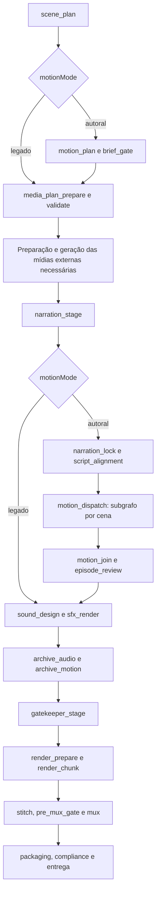
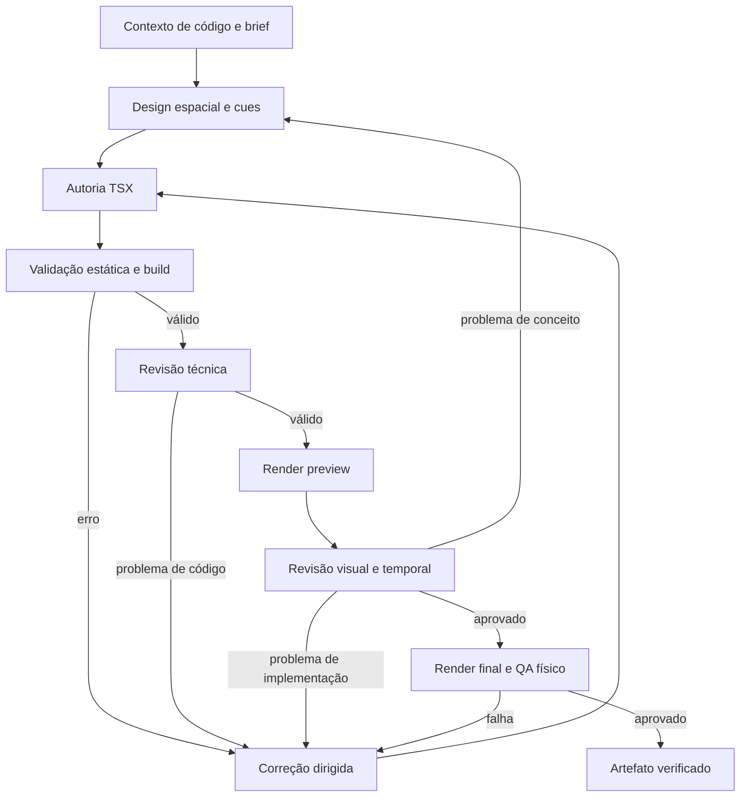

# Squad de motion graphics autoral no LangGraph

Plano de implementação — 8 de setembro de 2026.

Status: implementação base concluída no grafo TypeScript. O squad, o runtime isolado, o alinhamento da narração, o provider `remotion-authored`, a montagem final, a retomada e os testes automatizados estão integrados. O piloto físico 3D ainda depende de Docker Linux, uma imagem worker fixada por SHA-256 e um alinhador real configurado neste host. A integração do BRECHA continua depois dessa validação no HSL.

Arquivos operacionais e instruções de ativação: `graph/motion/README.md`. A execução anterior permanece disponível por `motionMode: legacy`; a nova rota é habilitada explicitamente com `motionMode: authored`.

## Resultado esperado

O agente recebe o roteiro e as evidências do episódio, identifica o que precisa ser explicado visualmente, concebe uma cena específica, escreve seu código 2D/3D, renderiza, avalia o resultado e corrige até cumprir o contrato. O vídeo final usa o motion aprovado, e a execução conserva o código-fonte editável e sua procedência.

“Sem modelos prontos” significa que a decisão não é escolher um item de um catálogo FLOW_MAP/BOTTLENECK e substituir textos. Composição, geometria, movimento e encadeamento são construídos para a explicação do roteiro. Continuam compartilhados os fundamentos técnicos: renderer, interpolação, carregamento de fontes, materiais básicos, primitivas geométricas, tokens da marca e validações.

Cada cena precisa de uma razão visual verificável: qual relação muda, qual fenômeno se torna compreensível e qual trecho do roteiro exige essa transformação. Movimento decorativo ou simples aproximação de imagem não atende ao modo autoral.

## Decisões de arquitetura

- Base: grafo TypeScript em `graph/production/graph.ts`, utilizado pelo Matrix.
- Squad: subgrafo dedicado, instanciado por cena, com estado, contratos e artefatos próprios.
- Autoria: agentes com chamadas efetivas ao modelo, saídas estruturadas e histórico de revisão. Serviços de compilação, render e validação executam operações determinísticas.
- 2D: React, SVG e Remotion para texto, dados, documentos e gráficos exatos.
- 3D: Three.js, React Three Fiber e `@remotion/three` para geometria, materiais, iluminação e câmera editáveis. A técnica é escolhida pela necessidade explicativa; o piloto exige pelo menos uma cena 3D real.
- Integração inicial: renderizar cada motion aprovado em um vídeo de cena com duração exata e inserir esse asset na composição final. Preservar fonte e bundle para edição e novo render. Isso permite aproveitar a montagem atual sem importar código dinâmico no bundle geral do episódio.
- Identidade: começar com um snapshot HSL. O contrato já recebe identidade visual como dado, mas o seletor e as políticas BRECHA ficam fora desta entrega.
- Falha: um motion reprovado não pode ser substituído silenciosamente por um template, fotografia com zoom ou vídeo generativo.

O pacote `@remotion/three` integra React Three Fiber ao Remotion e permite animação dirigida por `useCurrentFrame()`. Fixar versões compatíveis com o lockfile do projeto; testar o renderer ANGLE no host antes da autoria em escala. [Documentação oficial Remotion](https://www.remotion.dev/docs/three).

## Squad de produção

| Papel | Trabalho efetivo | Entrada | Saída auditável |
|---|---|---|---|
| Diretor de motion | Lê o roteiro completo; define objetivo, relações causais, técnica 2D/3D e continuidade entre cenas | Roteiro, fontes, identidade e timeline | `motion-brief.json` por cena e plano global |
| Analista de código | Analisa interfaces e utilitários reais do repositório; identifica recursos compatíveis, limitações e dependências | Snapshot de código selecionado, versões e brief | `code-context.json` com caminhos, hashes e proposta técnica |
| Designer espacial | Projeta composição, objetos, estados, câmera, luz e eventos ligados à narração | Brief, contexto técnico e alinhamento da fala | `scene-design.json` |
| Engenheiro de motion | Escreve componentes TSX, geometria e animação específicos; corrige diagnósticos de compilação | Design, SDK e revisões | Fontes, entrypoint e `source-manifest.json` |
| Revisor técnico | Inspeciona código e diagnósticos; verifica determinismo, imports, performance e correspondência entre design e implementação | Fonte e resultados dos verificadores | `technical-review.json` |
| Revisor audiovisual | Examina frames ordenados e amostragem temporal; compara transformação, legibilidade e momento da fala com o roteiro | Preview, cues, brief e fontes | `visual-review.json` com problemas por frame |

Os seis papéis são etapas especializadas, não seis processos simultâneos permanentes. Autor e revisor usam contextos separados. Um coordenador determinístico encaminha correções, controla orçamento e decide se as condições de saída foram atendidas.

Os modelos de autoria e visão devem ser configuráveis por função, registrando o modelo efetivamente utilizado. Usar a infraestrutura de contas e provedores disponível; não fixar um nome de modelo desnecessariamente. A disponibilidade real de saída estruturada e revisão visual é requisito do piloto.

## Entrada do squad: roteiro suficiente e estável

O planejador atual usa storyboards predefinidos. O squad não corrige automaticamente a falta de conteúdo editorial do episódio. Sua entrada mínima exige roteiro específico, relações causais identificáveis e fontes para valores apresentados como fatos.

Criar `motion_brief_gate`: recusar texto vazio, placeholder ou instrução sem mecanismo explicável; preservar o roteiro literal. Se faltam dados, registrar a lacuna. Usar representação qualitativa identificada quando autorizada pelo brief; não inventar medidas para preencher gráficos.

Começar com trechos aprovados de um episódio HSL existente. O autor de motion cria cenas a partir desses trechos, sem transformar a execução inicial em uma reescrita de todo o sistema editorial.

## Topologia do grafo principal



O diagrama resume trechos; preserva os nós de autenticação, revisão, orçamento e recuperação existentes dentro da preparação das mídias externas. A decisão de quais cenas serão motion acontece antes de congelar o contrato de provedores. A execução final dos motions acontece depois de fixar e alinhar a narração, antes do sound design e do gate de render.

Para episódios inteiramente autorais, as rotas de imagens e Firefly devem aceitar uma lista vazia e ser puladas explicitamente. Para episódios mistos, somente as cenas que dependem desses provedores entram nas filas correspondentes. O modo autoral não implica gerar todo o episódio em motion.

## Subgrafo de cada cena



Qualquer retorno consome um contador global da cena. Limites iniciais propostos: uma autoria inicial e até três revisões, com até uma revisão de conceito dentro desse total. Timeout, custo e número de renders também possuem limites configuráveis. Ao esgotar, emitir `MOTION_REVIEW_REQUIRED` com motivo, última prévia e diagnóstico; a retomada oferece corrigir o brief, ampliar orçamento explicitamente ou cancelar a cena/execução. Nenhum caminho converte reprovação em sucesso.

Autenticação ou indisponibilidade de provedor é classificada separadamente de falha criativa. Retry de transporte não pode duplicar uma autoria ou render já recebido e validado.

## Contratos de dados

`MotionBrief` deve conter `episodeId`, `beatId`, `sourceBeatId`, trecho literal da fala, contexto anterior/posterior, `claimRefs`, duração e intervalo global em frames, objetivo visual, relações causais, objetos necessários, restrições factuais e snapshot de identidade.

`SceneDesign` deve conter técnica 2D/3D, topologia e geometria dos objetos, estado inicial/final, mudanças observáveis, câmera, luz, materiais, textos exatos, fontes dos dados e cues vinculados às palavras ou frases alinhadas. Evitar uma propriedade `template` que restrinja o design a cenas prontas.

`MotionArtifact` deve conter engine `remotion-authored`, hashes do roteiro/áudio/alinhamento/brief/código/assets, versões de dependências e renderer, entrypoint, caminhos de fonte/preview/vídeo, resolução, FPS, frames exatos e recibos das revisões. Registrar separadamente `rendered`, `verified` e `approved`.

Saídas das chamadas ao modelo são JSON validado por schema. Arquivos grandes e binários ficam no disco, referenciados no estado. O estado pai recebe referências e resultados por `beatId`, com reducer idempotente; dois workers não podem sobrescrever a cena um do outro.

## Como o agente realmente analisa e escreve código

O driver Codex atual em `graph/ide/drivers/codex.ts` pede resposta JSON e proíbe ferramentas e edição direta. Portanto, mudar apenas o prompt para “programe um motion” seria insuficiente.

Criar um serviço de coleta de contexto que lê os arquivos permitidos, resolve imports locais relevantes e incorpora seu conteúdo e hash na tarefa. Não assumir que `contextFiles` sozinho torna o conteúdo disponível ao Codex: garantir inline explícito e verificar limites de tamanho.

O analista lê esse código real no contexto e produz a especificação técnica. O engenheiro devolve um pacote estruturado `files: [{path, content}]`, entrypoint e assets declarados. Um writer determinístico materializa o pacote na pasta da cena. Esse modelo reutiliza o transporte existente e torna a autoria efetiva sem exigir alterações livres no repositório por cada worker.

A pasta da cena tem entrypoint e bundle próprios. Nunca atualizar `remotion/Root.tsx`, `package.json` ou `build/` global como efeito da autoria de uma cena. A instalação das dependências ocorre uma vez na implementação do runtime, não por instrução do código gerado.

Validar caminhos resolvidos, imports permitidos e ausência de acesso arbitrário a arquivos, processos, rede e avaliação dinâmica. Compilação e render de código gerado ocorrem em worker isolado, com ambiente sem credenciais, dependências fixas, limites de execução e diretório específico. Validação estática sozinha não constitui isolamento; a fase inicial deve verificar como impor essa fronteira no host Windows, usando um worker/container dedicado quando necessário.

## Render 3D e sincronização

Toda transformação deve ser função do frame e de inputs versionados. Evitar animação dependente do relógio, estado acumulativo de um loop de jogo e aleatoriedade sem seed. Geometria, câmera e materiais permanecem editáveis nos fontes da cena.

Usar primitivas e geometria procedural específica primeiro. Assets externos precisam estar disponíveis localmente e declarados com origem e hash. Não depender de download de modelos 3D durante o render. Inicialmente entregar cenas full-frame opacas; camadas com transparência exigem contrato próprio de exportação e composição numa fase posterior.

O `pre_mux_gate` atual pode modificar a velocidade da narração após o render. No modo autoral, antecipar a adequação da narração à duração aprovada para `narration_lock`; depois alinhar texto e áudio final em `script_alignment`. O runtime deve produzir timestamps reais e confiança de alinhamento, por retorno do provedor ou alinhador compatível validado no piloto. Estimativa por número de palavras não vale como prova de sincronismo.

Validar se as falas correspondem aos intervalos planejados. Se um limite entre cenas não puder ser respeitado, bloquear para revisão explícita do timing; não deslocar silenciosamente cenas já autorizadas em provedores pagos. O `pre_mux_gate` passa a verificar o hash e a duração do áudio bloqueado no modo autoral, sem aplicar outra alteração de tempo. Mudar a narração invalida alinhamento, cues e renders afetados.

A trilha/SFX recebe os eventos físicos do motion aprovado para poder sincronizar efeitos com válvulas, cortes, deslocamentos e mudanças de estado, antes do mix final.

## QA que comprova a explicação

Compilar não é aprovação visual. Usar duas camadas de avaliação:

- Verificações objetivas: build, duração em frames, FPS, resolução, arquivos e hashes, carregamento de assets, erros de browser, valores/textos exigidos, limites de execução e áudio mestre correto.
- Avaliação audiovisual por modelo: clareza causal, correspondência factual, legibilidade, continuidade espacial, mudança de estado, câmera e sincronismo. A revisão precisa citar frames e trechos do roteiro para justificar falhas ou aprovação.

Gerar preview completo em resolução reduzida e extrair sequência ordenada de frames em todos os cues, incluindo antes/depois das mudanças e amostras intermediárias. Uma imagem isolada não demonstra qualidade temporal. O revisor recebe essa sequência e timestamps; acrescentar vídeo/áudio ao modelo somente se o provedor realmente suportar essa entrada.

Verificar separadamente o render final na resolução de entrega. A aprovação da prévia não cobre automaticamente o arquivo final: exigir hashes de entrada coincidentes, QA físico e amostras dos mesmos cues no resultado final. Após juntar as cenas, fazer uma revisão do conjunto para detectar repetição e quebra de continuidade que a avaliação isolada não encontra.

Limiares de legibilidade, tolerância de cues e limites de performance serão calibrados no piloto e salvos em arquivo de política. Não apresentar uma nota de um modelo como garantia matemática de qualidade ou originalidade.

## Mudanças obrigatórias no pipeline existente

| Arquivos/área | Mudança necessária |
|---|---|
| `graph/production/state.ts` | `motionMode`, versão comportamental, plano/results do squad, identidade de áudio bloqueado e referências de alinhamento; defaults compatíveis com estados antigos. |
| `hsl/core/types.ts` e `graph/production/lib/mediaPlan.ts` | Novo provider `remotion-authored`, conjuntos de cenas por responsabilidade e revisão versionada do contrato. Não rotular motion como Firefly. |
| `graph/production/nodes/media_plan.ts` | Consumir decisões autorais antes de congelar o plano e orçamento externo; tratar episódios sem takes pagos. |
| `nodes/visual_prompts.ts`, `image_generate.ts`, `image_review.ts`, `join_frames.ts`, `lib/frameInventory.ts` | Operar apenas sobre cenas que precisam de imagens; manter assets auxiliares de motion num inventário específico. Não exigir fotografia como pré-requisito de toda cena. |
| `nodes/fan_out_videos.ts`, `join_videos.ts` e fluxo Firefly | Excluir cenas autorais dos geradores externos e reunir resultados por provider sem perda ou duplicação. |
| `nodes/narration.ts`, `pre_mux_gate.ts` e áudio | Fixar áudio antes de cues, gerar alinhamento e remover ajuste tardio no modo autoral. |
| `graph/production/graph.ts`, `runner.ts`, CLI/Matrix | Integrar subgrafo, progresso por cena/agente, correções, limites e retomada; atualizar aliases e orçamento de passos. |
| `lib/mediaCoverage.ts`, `renderIdentity.ts`, `assets.ts` e gatekeeper | Exigir recibos e hashes próprios de motion e sincronizar suas cópias públicas. Auto-cura deve voltar ao renderer autoral. |
| `remotion/HslLongFormComposition.tsx` | Branch explícito para asset autoral: reprodução 1:1, sem Ken Burns ou HUD automático sobre a cena já composta. |
| Manifesto, `storage/` e compliance | Arquivar código/design/cues/recibos junto da mídia; validar cobertura autoral e política de qualidade. |
| `hsl/motion/motionDesign.ts` e `MotionModules.tsx` | Preservar para episódios legados. Modo autoral não usa seleção de template nem fallback para esses módulos. |

Não basta criar um MP4 na pasta de vídeos: os contratos atuais aceitam apenas alguns providers e validam cobertura, hashes e cópias públicas. A integração termina apenas quando toda essa cadeia reconhece o novo artefato.

## Organização proposta

```text
graph/motion/
  graph.ts, state.ts, contracts.ts
  nodes/                 # etapas de autoria, revisão e publicação do asset
  prompts/               # instruções dos papéis, não templates de cenas
  schemas/               # entradas e saídas de modelo
  runtime/               # coleta de código, writer, worker, render e QA
  tests/
remotion/motion-runtime/   # SDK e host 2D/3D; sem catálogo de cenas acabadas
runs/<episodeId>/motion/<beatId>/<revision>/
  brief.json, code-context.json, scene-design.json
  source/, source-manifest.json, cues.json
  previews/, reviews/, render/
  receipt.json
```

## Persistência e execução concorrente

Subgrafos devem herdar a persistência do grafo pai por invocação e ter isolamento por cena. Essa é uma aplicação do padrão de subgrafos para equipes de agentes descrito pelo LangGraph. Não compartilhar uma única memória persistente de cena entre workers concorrentes. [Subgrafos LangGraph](https://docs.langchain.com/oss/javascript/langgraph/use-subgraphs).

Começar com uma cena e um render por vez. Na etapa de escala, permitir duas autorias e um render simultâneos como configuração inicial, ajustada por medição de RAM/CPU/GPU e limites de conta. Adotar fan-out/fan-in com resultados indexados por `beatId` e revisão; não usar append cego de resultados em retries.

Cada ação grava tentativa, hash de input, modelo/worker e status. Materializar artefatos de forma atômica; conferir recibo antes de refazer trabalho. Falha depois de escrever um vídeo e antes de salvar checkpoint deve recuperar o vídeo verificado, sem render ou cobrança duplicados.

Manter nomes/IDs/checkpoints existentes. Executar estados antigos com `motionMode=legacy`; novas produções experimentais habilitam `authored`. A versão comportamental é separada da versão que atualmente participa do `thread_id`. Não aumentar `STATE_VERSION` indiscriminadamente e perder acesso aos checkpoints atuais.

## Fases e critérios de saída

| Fase | Entrega | Critério de saída |
|---|---|---|
| 0 — Base e prova técnica | Snapshot da base, testes existentes relevantes, worker isolado e render mínimo 3D no host | Three/Remotion compatíveis; câmera, geometria e luz reais; render reprodutível no ambiente fixo; sem alterar episódios antigos. |
| 1 — Squad independente | Pipeline completo de autoria/revisão para uma cena | Agentes analisam código real, produzem TSX específico, corrigem uma falha demonstrada e entregam fonte + vídeo + recibos. |
| 2 — Piloto editorial | Três cenas inéditas de mecanismos diferentes, total aproximado de 30–60 s | Pelo menos uma cena 3D; nenhuma selecionada de catálogo; alinhamento com fala e QA audiovisual aprovados. |
| 3 — Integração no grafo | Provider, filas, subgrafo, áudio bloqueado, composição final, gates e armazenamento | Episódio curto misto chega à entrega com motion autoral e mídia externa, preservando autoria e procedência. |
| 4 — Retomada e escala | Interrupções, retries, limites e concorrência controlada | Recupera uma execução interrompida, não repete trabalho válido e não troca artefatos entre cenas. |
| 5 — Adoção HSL | Um episódio HSL completo com modo autoral nas cenas designadas | Master aprovado, código arquivado, consumo e tempos medidos e aprovação editorial registrada. |

Somente após a fase 5 iniciar a integração BRECHA. Não estimar custo de produção ou prazo fechado antes de medir autoria, revisão e render nas fases 0–2; os tempos dependem do host, dos modelos e da complexidade das cenas.

Piloto sugerido, sujeito ao roteiro aprovado: fluxo por uma restrição de tubulação, mecanismo de pêndulo/amortecimento e propagação de falha numa rede. As três cenas exigem objetos e transformações distintos; a seleção é um teste de generalização, não três modelos fixos para produções futuras.

## Testes de aceitação

1. Brief novo produz design e código específico sem importar o catálogo de templates; revisar causalidade e geometria além de comparar strings.
2. Alterar uma relação do roteiro, como direção de fluxo ou estado de uma válvula, provoca mudança correspondente no design e no motion.
3. Falha de TypeScript retorna ao autor com diagnóstico; movimento visualmente incoerente retorna com frames e instrução localizada.
4. Correções têm limite; excedê-lo interrompe com diagnóstico e nunca produz status de aprovação artificial.
5. Todas as cenas autorais possuem duração exata e recibos; nenhum take Firefly é requisitado para elas.
6. Episódio inteiramente autoral passa pelas rotas vazias de imagem/Firefly sem falhar ou gerar mídia desnecessária.
7. Narração alterada invalida alinhamento/cues/renders; pre-mux não modifica áudio já bloqueado.
8. Motion entra no master sem zoom/HUD duplicados, sem frames vazios e com continuidade entre cenas.
9. Cenas concorrentes não disputam entrypoint, bundle, arquivos temporários ou checkpoint.
10. Interrupção depois de cada etapa cara recupera resultados válidos; artefato adulterado falha por hash.
11. Estado HSL anterior continua retomável e conserva o caminho legado.
12. Render final e artefatos arquivados correspondem à mesma revisão de código, design e áudio.

## Fora desta entrega

Integração BRECHA, migração indiscriminada de episódios antigos, geração de filmes inteiros por IA para substituir autoria em código, simulações físicas científicas sem validação específica, catálogo de assets 3D externos e composição com transparência avançada.

O caminho Python e o master legado continuam explicitamente HSL/legado durante o piloto. Antes de anunciar suporte geral ao modo autoral, encaminhar essas entradas ao mesmo runtime ou rejeitar a opção claramente. Nenhuma entrada pode aceitar autoria e executar templates silenciosamente.

## Condição para considerar o trabalho concluído

Um episódio HSL executado pelo LangGraph principal precisa conter motions concebidos a partir do roteiro, com fonte 2D/3D criada pelos agentes, sincronismo verificável, revisões reais, retomada funcional e entrega aprovada. Uma coleção de novos nomes de agentes ou uma galeria de demos isoladas não atende ao objetivo.
