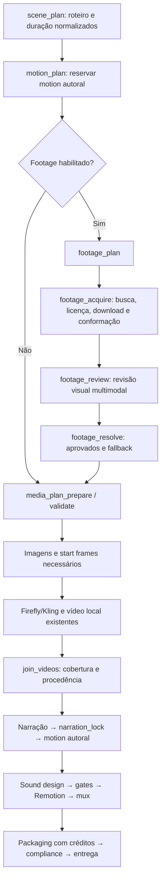

# Plano de integração de filmagens reais — HSL / LangGraph

Data: 10/09/2026. Status: arquitetura implementada no grafo principal TypeScript; piloto com credencial real ainda não executado.

Objetivo: os agentes identificarem oportunidades no roteiro, buscarem filmagens reais em fontes autorizadas, baixarem os trechos adequados e os integrarem ao documentário, mantendo Firefly/Kling, imagens, Remotion, motion autoral, narração e sound design.

## 1. Diagnóstico da arquitetura existente

A análise percorreu os pontos de entrada, grafos, contratos editoriais e de mídia, geração, montagem, validação, armazenamento e interface. Foi uma análise estática dos caminhos relevantes à mudança; não uma execução integral dos episódios nem uma auditoria de cada arquivo do acervo.

| Camada | Evidência no código | Implicação |
| --- | --- | --- |
| Entrada do workspace | `../package.json` encaminha Matrix/dashboard ao `hsl-video-studio` | Implementar primeiro neste projeto |
| Grafo principal TypeScript | `graph/langgraph.json`, `graph/production/studio.ts`, `graph/production/graph.ts` | Ponto principal de integração; Studio exporta o mesmo construtor usado pela produção |
| Plano de mídia | `graph/production/lib/mediaPlan.ts`, `hsl/core/types.ts` | Provedores fechados: `none`, `local-ffmpeg`, `firefly-kling`, `remotion-authored`; falta filmagem licenciada |
| Estado e retomada | `graph/production/state.ts`, `runner.ts`, `graph/checkpointer.ts` | Checkpoints, reducers e reinício precisam conhecer os novos artefatos |
| Motion autoral | `graph/motion/graph.ts`, `graph/production/nodes/authored_motion.ts` | Subgrafo com criação, revisão e recibos; preservar cenas selecionadas e sincronização com narração |
| Editorial e pós-produção alternativos | `hsl/editorial/types/editorial.ts`, `hsl/postproduction/postproductionRuntime.ts` | Já existe `licensed_real`, mas `LicensedAssetAgent.read()` apenas lê manifest fornecido; não descobre nem baixa vídeos |
| Validação dessa rota alternativa | `LicensedAssetAgent`, `MonetizationSafetyQaAgent` | Verifica campos/arquivo e presença de asset; `APPROVED` em JSON não comprova a licença por si só |
| Montagem principal | `remotion/HslLongFormComposition.tsx`, `graph/production/lib/renderIdentity.ts` | Vídeos locais entram por `outputVideoPath`; hashes vinculam o render aos arquivos efetivamente servidos |
| Grafo Python | `hsl_langgraph/graph.py`, `nodes.py`, `bridge.py` | Outro caminho de execução que chama estágios TypeScript; não é o grafo configurado no Studio |
| Orquestrador direto | `hsl/pipeline/masterOrchestrator.ts` | Caminho adicional de estágios; uma mudança só no LangGraph não o atualiza automaticamente |
| BRECHA dentro do HSL | `channels/`, `graph/production/nodes/scene_plan.ts` | Compartilha produção, com políticas e evidência específicas por canal |
| Plataforma BRECHA separada | `../canal-brecha-main/canal-brecha-main/core/` | Tem outra máquina de estados e contratos; `final-assembly/validation.ts` resolve vídeos a partir de `generatedClips`; precisa de adaptador próprio |

O README apresenta uma matriz 40/30/15/15, mas o `planMedia()` atual decide por intenção narrativa/provedor e evita promover cenas somente para preencher quota. Portanto, a integração deve usar o comportamento do código e uma política explícita, sem presumir que o README descreve todos os gates atuais.

## 2. Decisão de arquitetura

O módulo `graph/footage/` foi criado e é chamado pelo grafo principal **depois de `motion_plan` e antes de `media_plan_prepare`**.

No primeiro incremento, a aquisição termina antes de congelar o plano de mídia. Assim, uma busca sem resultado ou um download inválido devolve a cena à rota original antes de gerar prompts, aprovar orçamento ou despachar takes pagos. Isso evita alterar o hash global de mídia depois que o ledger Firefly já registrou operações.

Fluxo proposto, omitindo nós existentes de autenticação, revisão e arquivo para facilitar a leitura:



As arestas agora usam a rota opcional `footage_plan -> footage_acquire -> footage_review -> footage_resolve -> media_plan_prepare`. O módulo retorna seleções e artefatos sem escrever simultaneamente no `scenePlan`. Apenas o planejador principal aplica as seleções à timeline.

No MVP, manter esta parte sequencial. Paralelizar busca/download dentro do módulo somente com concorrência limitada, resultados por ID e união explícita; não abrir ramos concorrentes que modifiquem o plano ou iniciem `join_videos` antes da conclusão dos produtores.

## 3. Responsabilidades dos agentes e serviços

| Componente proposto | Trabalho | Saída verificável |
| --- | --- | --- |
| `FootageDirectorAgent` | Lê voz, assunto, função narrativa, duração e restrições; identifica oportunidades de filmagem real | Brief por beat, intenção documental, consultas, exclusões e fallback |
| `FootageSearchAgent` | Busca por objeto + ação + ambiente, com consultas específicas em inglês/português | Candidatos reais obtidos dos provedores, com IDs e URLs de origem |
| `FootageRightsGate` | Aplica regras de licença e verifica documentos; casos ambíguos não são aprovados pela opinião do LLM | Decisão `eligible`, `rejected` ou `review_required`, motivo e evidências |
| `FootageDownloadService` | Baixa versões permitidas, valida transporte e registra hashes | Original imutável, recibo e metadados técnicos |
| `FootageVisualReviewerAgent` | Examina frames e pequenos previews ao longo do trecho; confere conteúdo, continuidade e compatibilidade com a fala | Seleção com pontos de entrada/saída e justificativa; reprovação quando incerto |
| `FootageConformService` | Recorta, concatena quando autorizado, ajusta formato e remove áudio por padrão | MP4 com cobertura exata do beat e receita reproduzível |
| `FootageQaGate` | Confere arquivo, licença, conteúdo aprovado, duração, duplicação e rastreabilidade | Artefato aprovado vinculado ao beat |

Usar agentes para direção e julgamento visual. Download, hashes, regras de licença, contagem de frames e gravação de recibos são serviços determinísticos. Uma URL ou licença inventada por um modelo jamais vira candidato válido.

## 4. Como encaixar as imagens reais na narrativa

O brief deve indicar `illustrative_broll`, `verified_documentary` ou `archival`, além de objeto, ação, lugar/data quando necessários, tempo utilizável, aspectos proibidos e referência à fala.

- **B-roll ilustrativo:** uma instalação, processo ou objeto real que ajuda a explicar o tema; não afirma mostrar o caso específico.
- **Registro documental verificado:** precisa de origem e contexto que sustentem lugar, evento ou equipamento apresentados.
- **Arquivo histórico:** exige identificação temporal e tratamento editorial compatível.

Exemplo: em um episódio sobre bagagens, filmagem real mostra a esteira operando; Remotion explica o fluxo do identificador; Firefly representa o interior de um mecanismo inacessível. Uma esteira genérica não deve receber legenda que a apresente como Heathrow sem verificação específica.

Proteger cenas de anatomia técnica, mapas, diagramas, dados exatos, motion autoral selecionado e material já aprovado. Para novas execuções, reservar oportunidades em planos de contexto, escala, ambiente e processo físico. No MVP, cada beat elegível recebe um clipe final, que pode reunir recortes autorizados; inserções em subintervalos misturando vários provedores dentro do mesmo beat ficam para uma segunda versão do contrato.

O acervo precisa conter filmagem realmente captada por câmera. Não presumir isso apenas porque veio de um banco: rejeitar CGI/IA identificados; origem incerta não vira `real` automaticamente. Amostragem visual auxilia a revisão, mas não prova autenticidade sozinha.

Licença é filtro eliminatório. Depois dela, ordenar por aderência ao assunto e à fala, correspondência factual, qualidade técnica, possibilidade de recorte e continuidade visual. Popularidade não é evidência de baixo risco autoral.

## 5. Fontes e política de direitos

O catálogo inicial implementado consulta **Pexels**, **Pixabay**, **Wikimedia Commons**, **NASA Images** e **Internet Archive**. Pexels e Pixabay têm licenças próprias e não são classificados genericamente como CC0. O uso comercial e as modificações são aceitos apenas dentro das respectivas condições e restrições. [Licença Pexels](https://www.pexels.com/license/), [licença Pixabay](https://pixabay.com/service/license-summary/).

A integração Pexels deve mostrar o vínculo ao provedor e créditos na interface de resultados conforme suas diretrizes de API. Usar o endpoint atual `/v1/videos/`, autenticação e limites de requisição documentados. [API Pexels](https://www.pexels.com/api/documentation/).

A API Pixabay exige cache de consultas por 24 horas e restringe consultas automatizadas em grande volume e downloads sistemáticos em massa. O adaptador implementado usa o cache do manifest vinculado ao brief, pesquisa somente necessidades do episódio solicitado e não faz espelhamento de biblioteca nem varredura contínua. [API Pixabay](https://pixabay.com/api/docs/).

Também estão implementadas as fontes institucionais:

- **Wikimedia Commons:** verificar cada arquivo, criador, licença, obrigações e origem. Começar com domínio público documentado, CC0 e CC BY compatíveis. CC BY exige atribuição, licença e indicação de mudanças; licenças ShareAlike ficam fora da aprovação automática inicial. [Reuso Commons](https://commons.wikimedia.org/wiki/Commons:Reusing_content_outside_Wikimedia/en), [CC BY 4.0](https://creativecommons.org/licenses/by/4.0/).
- **NASA e acervos institucionais específicos:** úteis quando o assunto corresponde ao acervo. NASA informa que seu conteúdo geralmente não tem copyright nos EUA, mas há material de terceiros e restrições de identidade/endosso. A análise é por item e pelo contexto de uso; não basta o domínio ser governamental. [Diretrizes NASA](https://www.nasa.gov/nasa-brand-center/images-and-media/).
- **Importação manual licenciada:** receber arquivo e comprovante em um adaptador local, passando pelos mesmos gates.

Política automática inicial: excluir licença ausente/ambígua, restrição não comercial, restrição incompatível com edição, limitações de uso não atendidas e materiais de terceiros não esclarecidos. Pessoas reconhecíveis, marcas, obras dentro da filmagem e associação com fraude/crime precisam ser avaliadas no contexto; uma licença do clipe não resolve todos esses direitos.

Vídeos encontrados em YouTube, redes sociais, notícias e páginas de fabricantes não são elegíveis só por estarem acessíveis. No MVP, não usar um downloader universal como estratégia de aquisição. Aceitar no futuro apenas quando autorização, licença e meio de obtenção forem compatíveis e documentados. Termos como “no copyright” no título não servem como prova.

O sistema reduz risco por procedência e cumprimento da licença; não calcula uma probabilidade confiável de Content ID. A monetização por conteúdo reutilizado é uma avaliação separada de copyright: a própria política do YouTube exige contribuição original substancial e pode alcançar conteúdo utilizado com permissão. Preservar pesquisa, roteiro, explicação, montagem e gráficos próprios. [Políticas de monetização YouTube](https://support.google.com/youtube/answer/1311392?hl=en).

O upload e as verificações do YouTube podem integrar uma etapa futura de publicação autorizada. O fluxo de upload oferece verificações de direitos, mas isso não deve ser apresentado como certificação jurídica nem garantia permanente. [Upload e verificações](https://support.google.com/youtube/answer/57407?hl=en).

## 6. Contratos de dados

Adicionar `MediaProvider = 'licensed-footage'` mantendo os valores atuais. No adaptador do renderer legado, conservar inicialmente `visualMode: 'firefly_video'`, que o código já usa para vídeos de provedores diferentes. A origem verdadeira fica no provedor e nos recibos; UI, contagem de custos e relatório devem mostrar “filmagem real licenciada”. Uma futura renomeação de `visualMode` não precisa bloquear a entrega.

Versionar o plano ampliado como `hsl-media-plan/v2`, com validação explícita para v1 e v2. Execuções antigas ou com footage desligado continuam usando o contrato anterior sem migração silenciosa de hashes.

Contratos novos, com schema validado:

| Contrato | Campos essenciais |
| --- | --- |
| `FootageBrief` | `channelId`, `episodeId`, `beatId`, `sourceBeatId`, hash do brief, objetivo, uso documental, fala, consultas, exclusões, duração, fallback |
| `FootageCandidate` | fonte, ID externo, página original, criador, URL de download, dimensões/duração declaradas, contexto, indicação de conteúdo sintético quando disponível |
| `FootageRightsReceipt` | asset ID, titular/criador, licença e versão, URLs, data de obtenção, evidências preservadas e hashes, escopo comercial/edição, créditos, restrições, decisão e versão da política |
| `FootageSelection` | beat, asset(s), entradas/saídas, ordem, duração alvo em frames, crop/fit, uso ilustrativo ou documental, revisão visual e referências factuais |
| `FootageArtifact` | arquivo original e hash, derivado e hash, receita e hash, resolução/FPS/frames efetivos, recibos técnico/visual/licença |

Separar `rightsStatus`, `editorialStatus` e `technicalStatus`. Um asset só entra quando todos permitem o uso. Preservar autor/titular separadamente do usuário que publicou o arquivo.

No estado principal, guardar referências/manifests compactos e resultados por beat. Frames de revisão, originais e previews ficam em disco; não no SQLite de checkpoints. Reducers devem substituir por chave estável para que retomadas não dupliquem candidatos ou assets.

Os IDs de editorial (`scene_id`/`shot_id`) e da produção (`beatId`/`sourceBeatId`) precisam de uma tabela explícita de associação. O manifest antigo de licenciados é por cena e pode repetir o mesmo arquivo em vários shots; não assumir que ele suporta os novos recortes por shot sem adaptador.

## 7. Arquivos e retomada

Estrutura proposta dentro da execução:

```text
runs/<episode>/footage/
  brief.json
  candidates.json
  selections.json
  rights-manifest.json
  assets/<asset-id>/original.<ext>
  assets/<asset-id>/source.json
  assets/<asset-id>/license-evidence.json
  assets/<asset-id>/download-receipt.json
  qa/<beat-id>/...
  conform/<beat-id>.recipe.json
  footage-manifest.json
runs/<episode>/videos/<beat-id>.mp4
runs/<episode>/videos/<beat-id>.mp4.provenance.json
public/runs/<episode>/videos/<beat-id>.mp4
runs/<episode>/publication/footage-credits.md
```

Colocar o derivado em `videos/` aproveita a sincronização existente de `lib/assets.ts`; originais e documentação continuam separados. Revisar seletores de storage para não classificar todo `s.videos` como Firefly nem arquivar arquivos sem os recibos de licença correspondentes.

Downloads usam arquivo temporário, limites de tamanho/tempo, validação de conteúdo, hash e promoção atômica. Obter URLs por APIs/fontes permitidas; validar também redirects, rejeitar destinos locais/privados, limitar protocolos e executar FFmpeg com argumentos estruturados. Remover credenciais/tokens de logs e snapshots públicos.

Chave de aquisição: fonte + ID + versão/arquivo. Chave do derivado: hash original + seleção de recortes + duração + perfil técnico + receita. URL temporária não serve como identidade do arquivo. Em retomada, conferir o artefato antes de baixar novamente; downloads interrompidos só continuam quando a identidade remota confere.

Guardar evidências de licença e vínculo ao master enquanto ele estiver em uso. Deduplicação por hash pode compartilhar bytes no futuro, mas a aprovação contextual e os créditos continuam por uso/canal. Cache não vira acervo público de redistribuição.

## 8. Conformação e falhas

Para o grafo HSL atual: saída em 1920×1080, 30 FPS constantes, H.264 e formato de pixels compatível com o render. O perfil deve vir do contrato da execução; não transferir automaticamente os 24 FPS do Firefly configurado no projeto BRECHA separado.

Usar duração exata em frames e validar decodificação, frame final, proporção, crop, ausência de barras indesejadas e cobertura. Inspecionar previews distribuídos no intervalo, inclusive mudanças de plano. Não esticar, congelar ou repetir automaticamente uma filmagem insuficiente; procurar outro trecho ou combinar recortes aprovados.

Remover áudio original por padrão, preservando a narração, música e SFX atuais. Som ambiente da fonte só entra com licença e decisão sonora específicas. Silenciar reduz a exposição ao áudio embutido, mas não altera os direitos sobre as imagens.

O `OffthreadVideo` atual já é mutado; revisar a transformação de câmera e a vinheta aplicadas aos vídeos para que não recortem informação relevante. Filmagem ilustrativa deve ter metadados/rotulagem adequados ao canal, sem receber rótulo de evidência do evento por padrão.

| Situação | Comportamento |
| --- | --- |
| Nenhum candidato adequado | Registrar motivo e conservar provedor original antes de fechar plano |
| Licença ambígua ou conteúdo incompatível | Rejeitar candidato; tentar alternativa dentro do orçamento |
| Fonte fora do ar, 429 ou falha transitória | Retry limitado, respeitar limites; depois fallback |
| Arquivo corrupto, curto ou hash divergente | Não aprovar; tentar candidato alternativo |
| Licença/revisão faltante após plano fechado | Bloquear apenas a etapa dependente; não aprovar por ausência de erro |
| Necessidade de alterar seleção após dispatch pago | Criar revisão controlada e invalidar dependências; não reescrever plano/ledger silenciosamente |
| Usuário exige registro documental exato e nada atende | Retornar pendência explícita; não substituir por IA apresentada como prova |

## 9. Pontos exatos de implementação

| Local | Mudança necessária |
| --- | --- |
| `graph/footage/` (novo) | Contratos, subgrafo, adaptadores, download, conformação, QA e recibos |
| `hsl/core/types.ts` | Novo provedor, seleção de footage e versão ampliada de MediaPlan |
| `graph/production/state.ts`, `deps.ts` | Opções, dependências injetáveis, manifests e reducers |
| `graph/production/graph.ts` | Nós, arestas condicionais, `NODE_ORDER` e arquivo de footage |
| `graph/production/nodes/media_plan.ts`, `lib/mediaPlan.ts` | Projeção determinística das seleções; validação v1/v2; conjuntos disjuntos por provedor |
| `graph/production/nodes/visual_prompts.ts`, `join_frames.ts` | Ambos excluem hoje somente `remotion-authored`; excluir footage aprovado das exigências de start frame/prompt gerado |
| Filas/revisões de imagem e `frameInventory.ts` | Calcular obrigatoriedade de frame pelo provedor; thumbnail extraída não pode fingir aprovação de imagem gerada |
| `graph/production/lib/mediaCoverage.ts`, `nodes/join_videos.ts` | Exigir proveniência de filmagem licenciada além de arquivo existente; manter verificações Firefly/motion |
| `graph/production/lib/renderIdentity.ts` | Aceitar provedor e vincular seleção/receita/recibos; invalidar cache quando um trecho mudar |
| `remotion/HslLongFormComposition.tsx` | Tratamento visual e rótulos adequados, aproveitando vídeo local |
| Gatekeeper, validador de run e `spec/hsl-compliance-checker.ts` | Cobertura técnica, direitos e créditos; impedir autocura que converta silenciosamente footage em geração |
| `graph/production/storage/selectors.ts`, `tiers.ts` | Arquivar original, receita e prova de licença; preservar vínculo ao master |
| `graph/production/nodes/packaging.ts`, `hsl/packaging/thumbnailSeoEngine.ts` | Anexar créditos apenas dos trechos utilizados e registrar alterações exigidas pela licença |
| `graph/production/runner.ts`, `cli.ts`, `graph/console/` | Opções, nós anteriores ao MediaPlan, retomada/invalidação, progresso e métricas por provedor |
| `hsl/postproduction/postproductionRuntime.ts` | Adaptar manifest novo para `licensed_real`, com seleção por shot e prova de origem |
| Python e orquestrador direto | Adaptador compartilhado numa fase posterior; até lá, opção não suportada deve falhar claramente |
| Plataforma BRECHA separada | Contratos de footage aprovado e resolução na montagem; não fabricar `generatedClips`/jobs de geração para filmagens baixadas |

A validação atual de `firefly-hybrid` exige Firefly ou motion autoral. Definir explicitamente sua regra na v2: a adição de footage não deve transformar acidentalmente essa política em um episódio só de stock. Proteger as reservas de Firefly/motion previstas para a execução e testar conflitos de seleção.

## 10. Configuração inicial sugerida

Estas opções estão disponíveis no contrato do grafo; a CLI expõe `mode` e `maxTimelineShare`:

```json
{
  "footage": {
    "mode": "off | suggest | auto",
    "sources": ["pexels", "pixabay", "wikimedia", "nasa", "archive"],
    "maxTimelineShare": 0.15,
    "maxCandidatesPerBeat": 6,
    "maxQueryVariantsPerBeat": 2,
    "maxDownloadsPerBeat": 2,
    "downloadConcurrency": 2,
    "maxSearchRequestsPerEpisode": 200,
    "maxDownloadBytesPerEpisode": 1073741824,
    "sourceAudio": "mute",
    "preserveApprovedAssets": true,
    "fallback": "original-provider"
  }
}
```

`off` mantém o comportamento existente; `suggest` gera proposta para inspeção sem mudar o render; `auto` integra candidatos que passaram em todos os gates. Downloads de preview também consomem o orçamento e exigem fonte elegível.

O teto de 15% é uma escolha editorial inicial para manter footage complementar, não um limite jurídico nem uma quota mínima. Pode resultar em 0% quando nada adequado for encontrado. Medir por duração efetivamente exibida; manter orçamento financeiro de geração separado do orçamento de buscas/downloads.

Nas execuções antigas, usar `off` por padrão. Ativar o recurso em uma nova execução piloto; não modificar automaticamente episódios concluídos ou em andamento. Fonte sem chave fica indisponível com motivo visível. Retomada do ramo de footage em modo offline só reutiliza assets e recibos válidos; isso não promete operação offline para os demais agentes do projeto.

## 11. Implementação por entregas

1. **Contratos e seleção simulada:** schemas, provedor, configuração, fluxo opcional, compatibilidade v1/v2 e testes sem rede. Saída: plano de mídia coerente com fontes mistas e modo desligado equivalente ao atual.
2. **Catálogo e aquisição real:** buscas limitadas em Pexels, Pixabay, Commons, NASA e Internet Archive, metadados, evidência de licença, download, revisão visual e conformação. Saída: um beat aprovado e reproduzível a partir de uma fonte real.
3. **Integração ponta a ponta:** gates, render identity, Remotion, créditos, storage e Matrix. Saída: piloto de 60–90 segundos com filmagem real, Firefly, imagens e motion autoral.
4. **Retomada e episódio completo:** ensaios de falha, cache, orçamento, arquivo e 10–12 minutos no canal escolhido. Saída: master e pacote de procedência completos, sem regressão dos provedores existentes.
5. **Expansão:** novos acervos com licença legível por item, adaptador `licensed_real`, Python/orquestrador direto e plataforma BRECHA separada.

Não estimar prazo fechado antes do piloto: disponibilidade do acervo para temas técnicos e desempenho da revisão visual são as maiores incertezas. A primeira entrega útil é um trecho misto efetivamente renderizado, não apenas um agente retornando links.

## 12. Critérios de aceite

- Com footage desligado, os testes existentes de produção, mediaPlan, Firefly e motion mantêm seu comportamento e não fazem rede nova.
- Com footage habilitado, apenas beats elegíveis mudam de fonte; os conjuntos de provedores não se sobrepõem e a duração total permanece igual.
- Cada trecho utilizado tem arquivo local, hash, origem, licença comprovada, decisão editorial e receita de recorte.
- Arquivo/licença inválidos falham mesmo se o manifest disser `APPROVED`.
- Busca vazia, fonte indisponível e orçamento esgotado preservam a rota original antes do fechamento do plano.
- Retomada após interrupção não duplica download concluído nem dispara take pago novamente.
- Alterar arquivo, seleção ou duração invalida os artefatos dependentes; fonte não pode trocar silenciosamente mantendo o mesmo path.
- Render piloto prova cobertura completa, nenhum frame preto, áudio existente preservado e créditos apenas dos materiais usados.
- HSL e BRECHA não compartilham decisões editoriais, evidência factual ou rotulagem por engano.
- A interface distingue filmagem real, reconstrução IA e motion autoral; licença e papel documental aparecem separadamente.
- O pacote final inclui procedência e créditos, sem declarar garantia de monetização ou ausência futura de reivindicações.

Validação desta proposta: leitura estática dos componentes e consulta às fontes oficiais acima. Nenhum vídeo foi baixado, nenhuma chave foi utilizada e nenhuma execução de geração/render/publicação foi iniciada.
