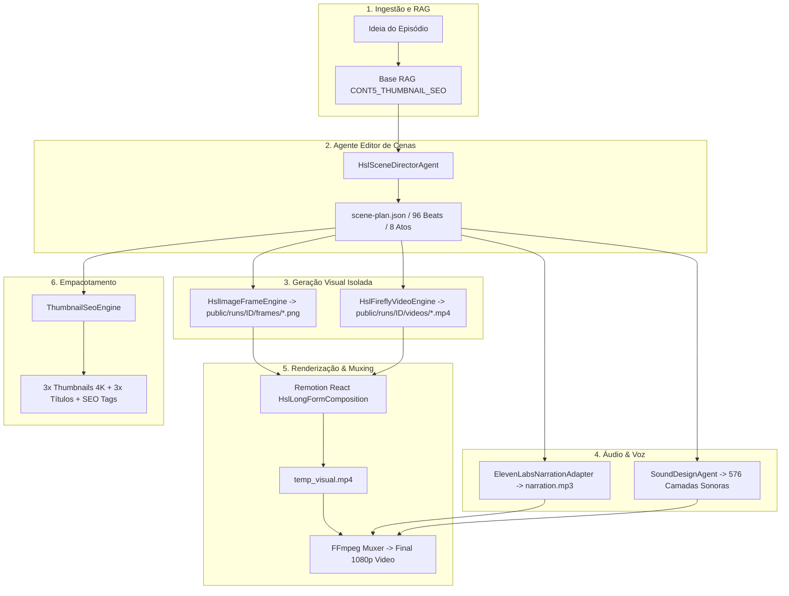

# 🏛️ ARQUITETURA TÉCNICA — HIDDEN SYSTEMS LAB (HSL)

## 1. Visão Geral da Arquitetura

O sistema é um pipeline multiagente autônomo baseado em TypeScript, React, Remotion e FFmpeg, integrado com ElevenLabs TTS e Adobe Firefly Video.

---

## 2. Mapa dos Módulos Principais

- **Agente Diretor de Cenas:** [`hsl/core/hslSceneDirectorAgent.ts`](file:///c:/Users/brend/OneDrive/Desktop/PROJETO%2030K%20ATE%2027/AGENTES%20-%20ANTIGRAVITY%20-%20HSL/hsl/core/hslSceneDirectorAgent.ts)
- **Gerador de Frames 35mm:** [`hsl/core/hslImageFrameEngine.ts`](file:///c:/Users/brend/OneDrive/Desktop/PROJETO%2030K%20ATE%2027/AGENTES%20-%20ANTIGRAVITY%20-%20HSL/hsl/core/hslImageFrameEngine.ts)
- **Orquestrador Firefly Video:** [`hsl/core/hslFireflyVideoEngine.ts`](file:///c:/Users/brend/OneDrive/Desktop/PROJETO%2030K%20ATE%2027/AGENTES%20-%20ANTIGRAVITY%20-%20HSL/hsl/core/hslFireflyVideoEngine.ts)
- **Adaptador ElevenLabs Failover:** [`adapters/elevenLabsNarrationAdapter.ts`](file:///c:/Users/brend/OneDrive/Desktop/PROJETO%2030K%20ATE%2027/AGENTES%20-%20ANTIGRAVITY%20-%20HSL/adapters/elevenLabsNarrationAdapter.ts)
- **Agente de Sound Design:** [`sound-agent/index.ts`](file:///c:/Users/brend/OneDrive/Desktop/PROJETO%2030K%20ATE%2027/AGENTES%20-%20ANTIGRAVITY%20-%20HSL/sound-agent/index.ts)
- **Composição Remotion React:** [`remotion/HslLongFormComposition.tsx`](file:///c:/Users/brend/OneDrive/Desktop/PROJETO%2030K%20ATE%2027/AGENTES%20-%20ANTIGRAVITY%20-%20HSL/remotion/HslLongFormComposition.tsx)
- **Motor de SEO & Thumbnails:** [`hsl/packaging/thumbnailSeoEngine.ts`](file:///c:/Users/brend/OneDrive/Desktop/PROJETO%2030K%20ATE%2027/AGENTES%20-%20ANTIGRAVITY%20-%20HSL/hsl/packaging/thumbnailSeoEngine.ts)
