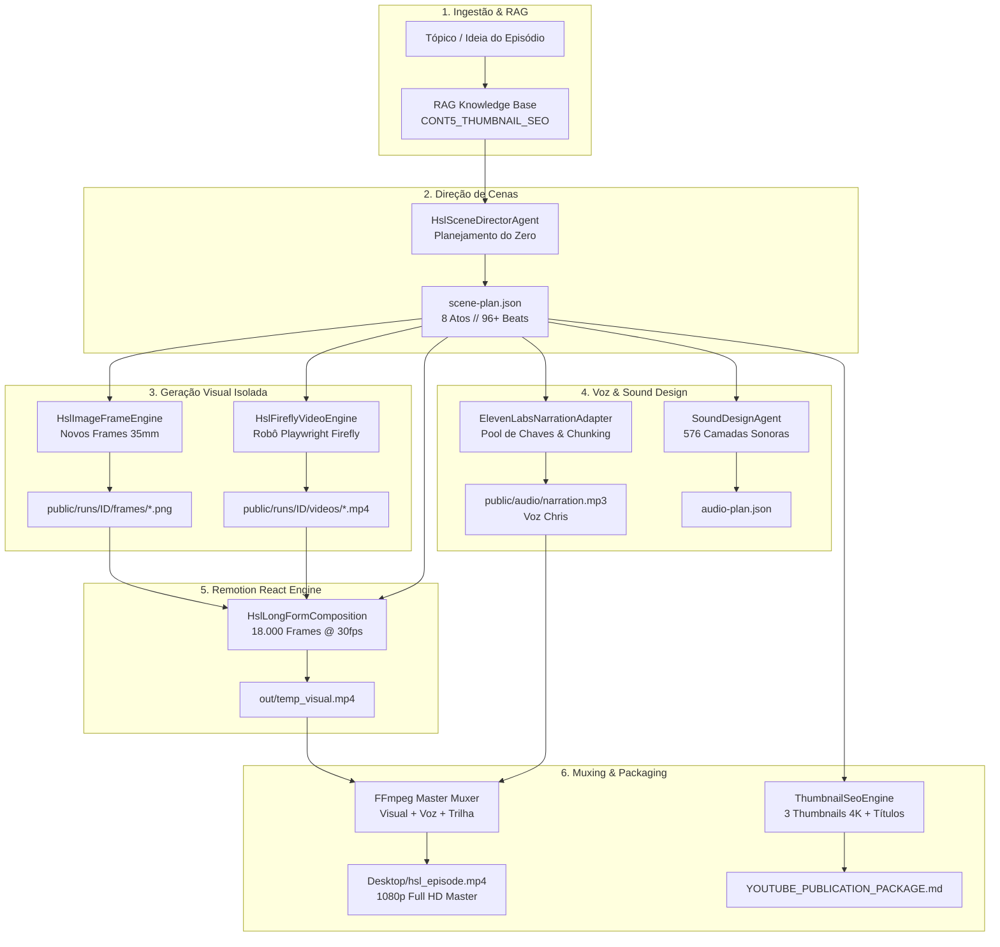

# 📐 HIDDEN SYSTEMS LAB (HSL) // MASTER PRD, ARQUITETURA & BRIEFING

> **Documento Oficial de Engenharia, Produto e Direção Criativa**  
> **Canal:** Hidden Systems Lab (HSL)  
> **Formato:** Documentários Long-Form de Engenharia e Sistemas Invisíveis (10 a 12 minutos)  
> **Idioma Primário:** Inglês Nativo (Voz Chris / ElevenLabs)  
> **Meta Operacional:** 30K inscritos / 1M+ views até 27 de cada mês  
> **Autoridade Numérica Executável:** [`spec/hsl-spec.ts`](file:///c:/Users/brend/OneDrive/Desktop/PROJETO%2030K%20ATE%2027/AGENTES%20-%20ANTIGRAVITY%20-%20HSL/spec/hsl-spec.ts) (As constantes e contratos em código são a autoridade final sobre valores numéricos).

---

## 📑 ÍNDICE
1. [PRD (Product Requirements Document)](#1-prd-product-requirements-document)
2. [Arquitetura Técnica do Sistema (Multi-Agent Engine)](#2-arquitetura-técnica-do-sistema)
3. [Briefing Editorial, Estética & Regras de Ouro](#3-briefing-editorial-estética--regras-de-ouro)
4. [Estrutura Canônica de 8 Atos (10–12 Minutos)](#4-estrutura-canônica-de-8-atos)
5. [Psicologia de Thumbnails & Títulos (Fórmula 1+1=3)](#5-psicologia-de-thumbnails--títulos)
6. [Guia de Comandos e Execução](#6-guia-de-comandos-e-execução)

---

## 1. PRD (Product Requirements Document)

### 1.1 Visão do Produto
O **Hidden Systems Lab (HSL)** é um ecossistema autônomo de produção audiovisual que disseca a infraestrutura física e lógica invisível que sustenta a civilização moderna.

Diferente de canais comuns de curiosidades, o HSL adota a ótica da **Engenharia de Sistemas Reais**: throughput, gargalos, redundâncias, pressões críticas, pontos de falha e consequências em cascata.

### 1.2 Proposta de Valor
- **Sem clichês ou generalismos:** Explica o mecanismo exato (física, voltagem, protocolos, mecânica de fluidos).
- **Estética Cinematográfica 35mm + Telemetria Vetorial:** Combinação de fotografia industrial analógica escura com gráficos HUD de precisão em Klein Blue e Acid Yellow.
- **Narrador Analítico Frio e Confiável:** Voz Chris (ElevenLabs), tom documental sóbrio, cadência controlada e dicção impecável.

### 1.3 Personas & Público-Alvo
- **Engenheiros de Software, Devs e Arquitetos de Sistemas:** Fascinados por sistemas distribuídos físicos.
- **Engenheiros Mecânicos, Civis e Eletricistas:** Interessados nas pressões reais, materiais e tolerâncias.
- **Audiência Internacional (EUA, Europa, Ásia):** Consumidores de canais como *Veritasium*, *Wendover Productions*, *Branch Education* e *Real Engineering*.

### 1.4 Requisitos Inegociáveis (Core Tenets)
1. **Duração Long-Form Estrita:** Vídeos entre **10 e 12 minutos** (600s a 720s // 18.000 a 21.600 frames @ 30fps).
2. **Cenas 100% Planejadas do Zero:** Proibido o uso de templates estáticos ou reutilização preguiçosa de sequências antigas.
3. **Mídias Visuais Reais em Cada Cena:** Proibido telas pretas ou fundos vazios. Alternância estrita entre:
   - Takes de Vídeo Cinematográfico gerados via Adobe Firefly Video.
   - Fotografias Documentais 35mm de alta resolução (granulação analógica, iluminação dramática).
   - Diagramas vetoriais de telemetria Remotion sobrepostos às fotos/vídeos.
4. **Resiliência de Áudio com Failover:** Rotação automática de chaves ElevenLabs com divisão de texto em blocos modulares.
5. **Sound Design Multi-Camadas:** Ambiência contínua, foley industrial tátil e trilha de suspense com ducking dinâmico.
6. **Empacotamento Completo:** A cada novo vídeo gerado, entregar 3 Thumbnails A/B/C em 4K, 3 Títulos 1+1=3 e metadados SEO.

---

## 2. Arquitetura Técnica do Sistema

O sistema opera como um **Master Squad Multiagente Autônomo** orquestrado em TypeScript e renderizado em React via Remotion.

### 2.1 Diagrama de Fluxo Ponta a Ponta



---

### 2.2 Componentes e Responsabilidades

| Componente | Arquivo Fonte | Responsabilidade |
| :--- | :--- | :--- |
| **Scene Director** | [`hsl/core/hslSceneDirectorAgent.ts`](file:///c:/Users/brend/OneDrive/Desktop/PROJETO%2030K%20ATE%2027/AGENTES%20-%20ANTIGRAVITY%20-%20HSL/hsl/core/hslSceneDirectorAgent.ts) | Cria a partitura de 96 a 120 beats dividida nos 8 atos canônicos para qualquer tema. |
| **Image Frame Engine** | [`hsl/core/hslImageFrameEngine.ts`](file:///c:/Users/brend/OneDrive/Desktop/PROJETO%2030K%20ATE%2027/AGENTES%20-%20ANTIGRAVITY%20-%20HSL/hsl/core/hslImageFrameEngine.ts) | Alimenta cada cena com fotografia analógica 35mm inédita isolada na pasta do episódio. |
| **Firefly Video Bot** | [`hsl/core/hslFireflyVideoEngine.ts`](file:///c:/Users/brend/OneDrive/Desktop/PROJETO%2030K%20ATE%2027/AGENTES%20-%20ANTIGRAVITY%20-%20HSL/hsl/core/hslFireflyVideoEngine.ts) | Despacha jobs e popula takes reais de vídeo gerados pela IA generativa da Adobe. |
| **ElevenLabs Adapter** | [`adapters/elevenLabsNarrationAdapter.ts`](file:///c:/Users/brend/OneDrive/Desktop/PROJETO%2030K%20ATE%2027/AGENTES%20-%20ANTIGRAVITY%20-%20HSL/adapters/elevenLabsNarrationAdapter.ts) | Gerencia pool de 3 chaves com rotação automática e concatenação FFmpeg de blocos de áudio. |
| **Sound Design Agent** | [`sound-agent/index.ts`](file:///c:/Users/brend/OneDrive/Desktop/PROJETO%2030K%20ATE%2027/AGENTES%20-%20ANTIGRAVITY%20-%20HSL/sound-agent/index.ts) | Mapeia picos de tensão, ruído foley industrial e ambiência sonora por beat. |
| **Long-Form Composition** | [`remotion/HslLongFormComposition.tsx`](file:///c:/Users/brend/OneDrive/Desktop/PROJETO%2030K%20ATE%2027/AGENTES%20-%20ANTIGRAVITY%20-%20HSL/remotion/HslLongFormComposition.tsx) | Composição React modular capaz de renderizar 18.000+ frames com Ken Burns e HUDs vetoriais. |
| **Packaging & SEO** | [`hsl/packaging/thumbnailSeoEngine.ts`](file:///c:/Users/brend/OneDrive/Desktop/PROJETO%2030K%20ATE%2027/AGENTES%20-%20ANTIGRAVITY%20-%20HSL/hsl/packaging/thumbnailSeoEngine.ts) | Gera 3 Thumbnails 4K (A/B/C), 3 opções de títulos estratégicos e descrição com timestamps. |

---

## 3. Briefing Editorial, Estética & Regras de Ouro

### 3.1 Identidade Visual (Paleta Obsidian + Cores de Alerta Técnico)
- **Obsidian (#07080B / #0D0E15):** Fundo base profundo e sóbrio. Nunca preto 100% puro (#000000).
- **Klein Blue (#0038FF):** Usado para indicar **Fluxo Normal**, dados, corrente estável e mapas base.
- **Acid Yellow (#FFE500):** Usado para indicar **Pontos de Tensão**, nós de gargalo e medições ativas.
- **Hyper Orange (#FF2E00):** Usado para indicar **Sobrecarga, Ruptura Física e Colapso Sistêmico**.
- **Titanium Gray (#E8ECF2 / #8B949E):** Tipografia técnica e retículas de suporte.

### 3.2 Linguagem Cinematográfica
- **Proibido 3D cartunesco ou bonecos vetoriais:** O HSL utiliza estética de fotografia industrial de 35mm (Arri Alexa LF, lentes anamórficas, granulação fina de filme Kodak Vision3).
- **Movimento de Câmera Sutil (Ken Burns):** Zoom lento (1.00x para 1.06x) e drift lateral constante para criar dinamismo sem perder a sobriedade.
- **Vignette Dramática:** Bordas escurecidas para focar o olhar do espectador no centro e na telemetria.

### 3.3 Identidade Sonora & Narração
- **Voz Chris (ElevenLabs `iP95p4xoKVk53GoZ742B`):**
  - Modelo: `eleven_multilingual_v2` (Inglês Nativo).
  - Estilo: Analítico, sóbrio, preciso, sem entusiasmo artificial de apresentador de TV.
  - Velocidade: Moderada, com pausas dramáticas nos momentos de ruptura do sistema.
- **Camada Musical:** Trilha contínua de suspense atmosférico (`suspense_oppressive_gloom.mp3`) operando em volume atenuado (-28dB / 0.045) com ducking dinâmico sob a voz.

---

## 4. Estrutura Canônica de 8 Atos (10–12 Minutos)

Todo episódio do canal segue a jornada estrutural de 8 atos:

```
[00:00 - 01:15] ACT 1: THE HOOK & THE VISIBLE MIRACLE (O milagre visível e o paradoxo)
[01:15 - 02:45] ACT 2: THE PHYSICAL ANATOMY (Dissecação camada por camada)
[02:45 - 04:30] ACT 3: THE FLOW DYNAMICS (A matemática de vazão e rendimento)
[04:30 - 05:45] ACT 4: THE PHYSICAL LIMIT (O limite termodinâmico/mecânico extremo)
[05:45 - 07:15] ACT 5: THE BOTTLENECK (O ponto exato onde a pressão se acumula)
[07:15 - 08:15] ACT 6: THE EMERGENCY WORKAROUND (Como o sistema sobrevive no improviso)
[08:15 - 09:15] ACT 7: SYSTEMIC CONSEQUENCES (O efeito cascata e o custo econômico)
[09:15 - 10:00] ACT 8: ORIGINAL THESIS (A tese filosófica da infraestrutura invisível)
```

---

## 5. Psicologia de Thumbnails & Títulos (Fórmula 1+1=3)

Baseado nos estudos científicos de retenção e CTR documentados na base RAG ([`CONT5_THUMBNAIL_SEO_PSYCHOLOGY.md`](file:///c:/Users/brend/OneDrive/Desktop/PROJETO%2030K%20ATE%2027/AGENTES%20-%20ANTIGRAVITY%20-%20HSL/rag/source/CONT5_THUMBNAIL_SEO_PSYCHOLOGY.md)):

### 5.1 As 3 Thumbnails Obrigatórias por Episódio (4K UHD)
1. **Variante A (Face + Technical Evidence):**
   - Rosto humano com microexpressão de tensão/foco olhando na direção do objeto ou dado.
   - Gera de **25% a 38% mais cliques** do que imagens sem sujeito humano.
2. **Variante B (Before / After Split Screen):**
   - Lado Esquerdo: Fluxo Normal (Klein Blue).
   - Lado Direito: Colapso do Sistema (Hyper Orange).
   - Divisória luminosa e medidores em saturação crítica.
3. **Variante C (Hero Object / Extreme Constraint):**
   - Macro close-up no gargalo físico com retícula de telemetria e texto curto de 2 a 3 palavras (`THE REAL BOTTLENECK`).

### 5.2 Estratégia de Títulos (Regra 1+1=3)
- **Título 1 (SEO & Volume de Busca):** Palavras-chave exatas que o usuário digita.
- **Título 2 (Curiosity Gap & Escala):** Revela uma ordem de grandeza inacreditável (ex: *10,000 Volts Under 4,000m of Water*).
- **Título 3 (Paradoxo / Contradição):** Confronta o senso comum (ex: *Why the Fastest Internet Runs on 17mm of Fragile Glass*).

---

## 6. Guia de Comandos e Execução

Para rodar qualquer estágio da produção autônoma, utilize os comandos oficiais:

```bash
# 🚀 1. Gerar Episódio Master Long-Form Completo (10 Minutos // 18.000 Frames)
npm run hsl:episode

# 📦 2. Gerar Pacote de Publicação YouTube (3 Thumbnails 4K + Títulos 1+1=3 + SEO)
npm run hsl:package

# 🌊 3. Gerar Episódio Especial Subsea Fiber
npm run hsl:subsea

# 🧠 4. Reconstruir Base de Conhecimento RAG de Thumbnails e SEO
npm run rag:build

# 🔍 5. Validar Compilação TypeScript de Toda a Workspace
npx tsc --noEmit
```
