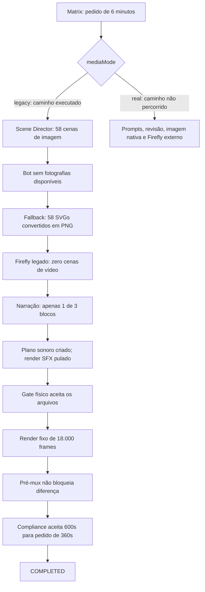

# HSL_EPISODE_003 — auditoria dos agentes, grafo e entrega

Data: 05/09/2026. Episódio: **The Cooling System That Keeps Data Centers Alive**.

**Conclusão:** os quatro problemas foram confirmados. A execução recebeu corretamente seis minutos, percorreu o ramo `legacy`, substituiu fotografias ausentes por PNGs procedurais, planejou zero cenas Firefly, pulou SFX e renderizou dez minutos. A validação permitiu concluir uma entrega que não cumpre o pedido. A narração também está incompleta: apenas um dos três blocos entrou na concatenação.

O problema está nas decisões, contratos e verificações da aplicação. Não há evidência de que executar fora de uma IDE tenha causado um defeito no LangGraph. Abrir a mesma execução em uma IDE não resolve estas condições.

## 1. Evidência e limites da análise

Foram inspecionados código atual, diferenças locais preexistentes, checkpoint SQLite aberto em **somente leitura**, manifestos, histórico de nós, imagens e MP4. FFprobe mediu streams e duração; FFmpeg mediu tela escura e silêncio. Foram feitas reproduções isoladas de funções atuais com dependências simuladas, sem executar produção.

Nenhuma configuração de produção, código da aplicação, mídia original ou checkpoint foi alterado por esta auditoria. Os arquivos criados estão nesta pasta; a reprodução também criou uma pasta temporária própria, indicada em `reproduction.json`. Não houve geração de imagens, TTS ou despacho pago.

**Distinção temporal:** o repositório já continha muitas alterações locais. A CLI atual foi modificada às 18:57, depois do encerramento registrado às 18:53. O checker atual foi modificado às 18:47. Portanto, o relatório diferencia o histórico comprovado da execução e o comportamento reproduzível do código atual; não atribui autoria às alterações.

| Medida | Resultado comprovado |
|---|---|
| Pedido persistido | `targetMinutes=6`, `mediaMode=legacy`, `testRender=false`, `offline=false` |
| Plano | 58 beats, oito atos, 10.800 frames; soma das cenas = 360s |
| Tipos de cena | 58 `generated_image_35mm`; zero `firefly_video` |
| Arquivos de imagens | 58 PNGs; 58 SVGs correspondentes; zero SVG com imagem embutida |
| Start frames fotografados/gerados | Pasta `start-frames` vazia; manifesto `APPROVED` com `items=[]` |
| Firefly | Zero takes; zero gerações; nenhum nó de sessão/despacho real no histórico |
| SFX | `sfx_render` pulado; `sfxTrackPath=null`; zero efeitos resolvidos |
| Vídeo entregue | H.264, 1920×1080, 30fps, 18.000 frames, **600s** |
| Tela escura | **360,000s até 599,967s**, aproximadamente 240s |
| Áudio do master | AAC, mono, 44,1kHz; silêncio abaixo de −45dB de **154,427s até 599,980s** |
| Narração registrada no estágio 4 | 155,352s |
| Narração existente hoje | MP3, mono, 24kHz, 600s; cerca de 445,5s finais de silêncio |
| Pré-mux persistido | Diferença de **444,648s**, `applied=false`, estágio `DONE` |
| Compliance final | Oito regras aprovadas, apesar das divergências acima |

O detector de preto foi aplicado de 350s até o fim, reduzindo a imagem para 320px, com `pic_th=0.98`, `pix_th=0.10` e duração mínima de 1s. Os timestamps no log exigem somar 350s. A constatação foi confrontada com a cobertura matemática da timeline e com frames extraídos a 359s, 361s e 599s. Não houve análise semântica automatizada de cada frame do vídeo.

Artefatos desta auditoria: [evidência estruturada](<C:/Users/Paulo R Advocacia/Documents/HSL - STUDIO/docs/graph/EP003-AUDIT-2026-09-05/evidence.json>), [reproduções](<C:/Users/Paulo R Advocacia/Documents/HSL - STUDIO/docs/graph/EP003-AUDIT-2026-09-05/reproduction.json>), [detecção de tela escura](<C:/Users/Paulo R Advocacia/Documents/HSL - STUDIO/docs/graph/EP003-AUDIT-2026-09-05/blackdetect.txt>) e [detecção de silêncio no master](<C:/Users/Paulo R Advocacia/Documents/HSL - STUDIO/docs/graph/EP003-AUDIT-2026-09-05/silencedetect-master.txt>).

## 2. Qual grafo e quais agentes realmente executaram

O launcher `HSL-MATRIX.cmd` chama `npm run hsl:matrix`, que inicia `graph/console/cli.ts`. Essa console inicia `graph/production/cli.ts`, que compila `graph/production/graph.ts`. A thread auditada é **HSL_EPISODE_003@v2**, persistida em `database/langgraph-checkpoints.sqlite`.

Existe também `hsl_langgraph/graph.py`, acessível por outra CLI. Ele **não é o grafo identificado pelo stack trace e pelo histórico desta execução**. Alterar apenas o grafo Python deixaria estes problemas do Matrix intactos.



Este é um mapa causal simplificado; o grafo também contém arquivamento, retomadas e sincronização de chunks.

| Agente apresentado no Matrix | Implementação e comportamento efetivo no EP003 |
|---|---|
| Scene Director | `HslSceneDirectorAgent` seleciona storyboards por palavras-chave; normalização posterior reduz o plano canônico para seis minutos. Não é, nesta rota, um agente LLM pesquisando o episódio do zero. |
| Visual Intelligence | No ramo real, Antigravity produz prompts e Codex os revisa. Esses nós não foram percorridos. |
| Codex Image Agent | O worker nativo `generateCodexImages` não foi chamado. A rota usada chama `HslImageFrameEngine` e o adaptador do bot ChatGPT. |
| Vision Gatekeeper | A revisão de fidelidade, texto e continuidade de imagens do ramo real não ocorreu. Restou a validação técnica dos PNGs. |
| Kling 2.5 Turbo | Os nós reais de sessão, orçamento, despacho e intake não ocorreram. O motor legado recebeu zero beats de vídeo. |
| Narration Engine | Adaptador TTS tolera perda de blocos e aceita concatenação parcial. O estado conserva 155,352s mesmo após alterações posteriores no arquivo. |
| Sound Design Crew | Gerou plano JSON/TSX; SFX foi explicitamente pulado. Plano escrito não equivale a trilha incorporada no master. |
| Render Core | Quatro chunks fixos cobrem 600s; as sequências das cenas terminam em 360s. |
| Compliance Sentinel | Valida predominantemente estrutura, formato e presença de arquivos. Não prova fotografia, execução Firefly, cobertura da fala ou presença de SFX. |
| Drive Vault | `storageMode=off`; etapas de arquivo/índice locais não demonstram publicação ou qualidade audiovisual. |

Os nomes em `graph/console/model.ts:19` agrupam nós para apresentação. Não são dez agentes autônomos com garantia de execução. A documentação do LangGraph confirma que nós podem ser funções determinísticas ou conter LLMs; a lógica e as condições precisam ser implementadas pela aplicação. [Graph API](https://docs.langchain.com/oss/javascript/langgraph/graph-api).

## 3. Causas dos problemas

### 3.1 Fotografias substituídas por cartões gráficos — P0

**Cadeia causal confirmada:**

1. `graph/console/cli.ts:98` escolhe `legacy` se `HSL_FIREFLY_AGENT_DIR` não estiver definida. `graph/production/cli.ts:76` repete essa decisão como padrão. Isso vincula indevidamente fotografia, revisão e áudio à disponibilidade de um único provedor de vídeo.
2. O checkpoint prova a execução em `legacy`. A variável também está ausente no ambiente atual consultado.
3. `adapters/chatgptImageAdapter.ts:99` retorna sem falhar se o script do bot não existir. O script local `chatgpt-image-bot/src/main.py` está ausente no ambiente auditado. Não há log completo do subprocesso de imagem que permita provar cada detalhe de sua falha histórica.
4. `hsl/core/hslImageFrameEngine.ts:1753` copia uma fotografia somente se ela existir. Caso contrário, usa `universalThemeSceneSvg` e Resvg; esse substituto satisfaz a verificação de PNG.
5. Há 58 SVGs sem qualquer imagem embutida, 58 PNGs e nenhum start frame. A inspeção visual de `SCENE_001.png` confirmou o cartão “THERMAL CRISIS”, sem fotografia.

**Defeitos adicionais do contrato visual:**

- Todos os 58 prompts contêm instruções de tipografia. `formatCinematic35mmPrompt`, em `hsl/startframe/chatgptStartFrameRuntime.ts:29`, retorna o prompt intacto se encontrar “cinematic 35mm”. A reprodução confirma que a exigência de ausência de texto não é acrescentada nesse caso. Mesmo um gerador disponível receberia instruções conflitantes.
- O mesmo runtime escreve `status=APPROVED` mesmo quando nenhuma imagem foi gerada e usa `Date.now()` em um campo denominado SHA-256. Isso não comprova geração, revisão nem hash criptográfico.
- O storyboard escolhe tema pelo conteúdo do briefing, enquanto o motor legado escolhe seu renderer específico pelo ID do episódio. O ID genérico `HSL_EPISODE_003` cai no renderer universal.

**Correção necessária:** imagem fotográfica e gráficos devem ser contratos distintos. Ausência de fotografia requerida deve bloquear a etapa ou abrir uma pausa recuperável. O renderer procedural só deve atender cenas explicitamente classificadas como gráfico/diagrama/título. Revisão e procedência devem permanecer obrigatórias para o perfil documental.

### 3.2 Seis minutos transformados em dez, com cauda escura — P0

O plano está correto quanto à duração: `totalFrames=10800`, soma dos beats = 10.800. A falha ocorre depois.

[graph/production/lib/remotion.ts:4](<C:/Users/Paulo R Advocacia/Documents/HSL - STUDIO/graph/production/lib/remotion.ts:4>) fixa quatro ranges até o frame 17.999 e os devolve sempre que `mediaMode=legacy`. [remotion/Root.tsx:72](<C:/Users/Paulo R Advocacia/Documents/HSL - STUDIO/remotion/Root.tsx:72>) também registra a composição com duração canônica fixa. Em `HslLongFormComposition.tsx:344`, as sequências cobrem apenas a soma real dos beats. Após o frame 10.799 resta o fundo escuro da composição.

```text
Solicitado e planejado: 360 × 30 = 10.800 frames
Renderizado:           600 × 30 = 18.000 frames
Sem cenas:                         7.200 frames = 240 segundos
```

`Render 4/3` é uma evidência da divergência: o executor fez quatro chunks fixos; `graph/console/progress.ts:37` calcula três chunks a partir dos 10.800 frames do plano. Não significa necessariamente quatro tentativas para três tarefas.

As reproduções com o código atual mostram que pedidos de 3, 6 e 12 minutos recebem 600s no ramo legado. No ramo real, o cálculo dos ranges acompanha o plano; a composição fixa ainda precisa ser corrigida, especialmente para durações acima de dez minutos.

**Correção necessária:** uma única função deve validar e fornecer `fps`, frames, duração e ranges para planejamento, Remotion, stitch, progresso e QA. Para seis minutos: `[0,4499]`, `[4500,8999]`, `[9000,10799]`. A composição deve obter a duração das props por `calculateMetadata`, mecanismo previsto pelo Remotion. [Documentação oficial](https://www.remotion.dev/docs/calculate-metadata).

### 3.3 Firefly não executado — P0

Há **duas causas independentes**, comprovadas:

- O modo legado desviou dos nós externos reais.
- O storyboard de cooling (`hsl/editorial/topicStoryboards.ts`, a partir da linha 406) atribui `generated_image_35mm` a todos os beats. O plano normalizado manteve zero `firefly_video`.

`fireflyGuide`, em `graph/production/nodes/firefly_real.ts:7`, seleciona exclusivamente beats `firefly_video`. A reprodução, trocando apenas o modo para `real` e mantendo o plano, produz **zero takes e `skipped`**. Portanto, preencher a variável de ambiente isoladamente não entrega movimento Firefly.

Além disso, `HslFireflyVideoEngine` legado usa FFmpeg `zoompan` sobre imagens locais (`hsl/core/hslFireflyVideoEngine.ts:35`); seu nome e comentário não comprovam uma chamada ao Adobe Firefly. Neste episódio ele nem produziu esses vídeos locais, pois não havia cenas elegíveis.

`maxGenerations=0` não é, sozinho, um defeito: no caminho real com takes planejados, representa a necessidade de passar pelo orçamento antes do despacho. A solução não é liberar gerações ilimitadas.

**Correção necessária:** um planejamento explícito de mídia deve selecionar cenas com movimento motivado, produzir uma lista não vazia de takes quando Firefly faz parte do perfil escolhido, calcular a quantidade exata e preservar o recibo de autorização e despacho. Identificar separadamente provedores `firefly-kling` e movimento local.

### 3.4 Efeitos sonoros ausentes — P0

[graph/production/nodes/sfx_render.ts:5](<C:/Users/Paulo R Advocacia/Documents/HSL - STUDIO/graph/production/nodes/sfx_render.ts:5>) retorna `skipped` em `legacy`. O checkpoint confirma `sfxTrackPath=null`.

`sound_design` gera `audio-plan.json` e `remotion/TestVideo1MinAudio.tsx`. O vídeo é renderizado com `--muted`, e o mux seleciona `muxFinalWithSfx` somente se `mediaMode=real` **e** existir `sfxTrackPath` (`nodes/mux.ts:12`). Assim, nem o plano escrito nem a indicação de etapa concluída garantem efeitos no master. Mesmo no modo real, um path nulo pode cair silenciosamente no mux sem SFX.

Há infraestrutura aproveitável: `graph/audio/worker.ts` valida banco Kenney, hashes, formato, densidade, plano e trilha resultante. Ela precisa integrar o contrato obrigatório de áudio, independentemente do modo de imagem/vídeo.

O mapeamento `soundDesignInput.ts` ainda fixa `industrial_refinery` para todos os episódios. Para cooling, ambientes e eventos devem derivar das cenas: ventilação, bombas, válvulas, circulação e transições justificadas. Não basta tornar o áudio audível; ele deve corresponder ao episódio.

### 3.5 Narração parcial e silêncio prolongado — P0 adicional

O texto concatenado do plano tem **1.038 palavras**, dividido pelo adaptador em três blocos: 344, 366 e 328 palavras. A pasta temporária contém:

| Arquivo | Tamanho | Duração |
|---|---:|---:|
| `chunk_000.mp3` | 932.112 bytes | 155,352s |
| `chunk_001.mp3` | 0 bytes | Inválido |
| `chunk_002.mp3` | 0 bytes | Inválido |

Os horários coincidem com a etapa de narração do EP003 e `concat_list.txt` contém apenas `chunk_000.mp3`. A duração é idêntica à registrada no manifesto. Essa convergência comprova a concatenação incompleta; a causa específica da falha dos dois pedidos TTS exige os logs do provedor, que não estão preservados nesse histórico.

[adapters/elevenLabsNarrationAdapter.ts:142](<C:/Users/Paulo R Advocacia/Documents/HSL - STUDIO/adapters/elevenLabsNarrationAdapter.ts:142>) captura falha de bloco e continua. Depois concatena apenas os disponíveis, não verifica o retorno do FFmpeg e informa sucesso usando o total **planejado** de blocos. Também permite troca automática de ElevenLabs para Edge-TTS, sem um recibo de provedor no estado do episódio.

`pre_mux_gate` registra uma diferença de 444,648s e não lança erro se a sincronização falhar. A reprodução isolada devolveu etapa **DONE** com essa diferença. A versão atual de `syncNarration` usa `apad/atrim`, capaz de transformar áudio curto em um arquivo longo por preenchimento com silêncio. O arquivo atual de narração tem 600s; seu timestamp é posterior ao mux inicial e o estado continua com 155,352s. Não é possível atribuir a modificação posterior a um comando específico somente com esses arquivos.

**Correção necessária:** exigir todos os blocos e seus hashes, preservar o áudio bruto, validar concatenação e cobertura do roteiro, alinhar fala às cenas e bloquear diferenças excessivas. Ajustes pequenos de tempo podem ser permitidos com limite explícito; centenas de segundos de silêncio não podem “corrigir” narração incompleta.

### 3.6 Por que a entrega recebeu COMPLETED — P0

O problema de maior alcance é a autorização de sucesso sem comprovar os requisitos do produto:

- [spec/hsl-compliance-checker.ts:91](<C:/Users/Paulo R Advocacia/Documents/HSL - STUDIO/spec/hsl-compliance-checker.ts:91>) amplia a faixa aceitável para **360–720s** quando o pedido é seis minutos. Não compara o master ao alvo exato.
- A regra de atos verifica quantidade e duração declarada, mas não exige igualdade entre timeline, soma dos beats e vídeo real.
- “Zero Tela Preta” delega à integridade dos arquivos de cada beat; não inspeciona a cauda do master.
- A sincronização compara durações de arquivos. Áudio de 600s com silêncio final pode ser aprovado.
- Nenhuma das oito regras exige cobertura dos blocos narrados, imagens fotográficas, recibos Firefly, SFX incorporado ou áudio final no formato previsto.
- `nodes/compliance.ts:7` reutiliza um relatório aprovado pelo ID do episódio, sem conferir hashes atuais do plano/master nem versão das regras.
- `finalize` deriva `COMPLETED` do estado e desse relatório. O status mede o êxito dessas regras incompletas.

Houve ainda uma falha inicial do mux por trilha de suspense inexistente às 18:35, seguida de retomada às 18:42. O código atual tolera música ausente; não há prova de música incorporada nesta entrega. A medição de silêncio do master confirma que não existe cama sonora audível após 02:34 no limiar utilizado.

### 3.7 Erro de thread finalizada — P1

O histórico encerra às 18:53:10 e o checkpoint final contém `COMPLETED`. O erro colado pelo usuário vem da política da CLI ao tentar continuar uma thread sem próximos nós; não prova perda do checkpoint ou falha de renderização adicional.

O código **atual**, modificado às 18:57, já contém retornos específicos para `COMPLETED` em `graph/production/cli.ts:85` e `graph/console/cli.ts:105`. É uma correção local preexistente à auditoria, ainda não validada aqui por execução real da CLI de produção. Reiniciar a console carrega a nova versão, mas a qualidade da entrega continuará incorreta enquanto os outros pontos persistirem.

## 4. Fragilidades adicionais da configuração do grafo

Estes pontos são defeitos de implementação ou riscos encontrados na inspeção; não foram todos acionados pelo EP003.

| Área | Achado | Consequência e tratamento |
|---|---|---|
| Configuração na retomada | `resumeEpisode` recalcula `mediaMode` e storage pelo ambiente atual | Uma retomada pode alterar a rota de um plano já gerado. Persistir configuração resolvida; migração deve ser explícita e invalidar dependências. |
| Cache de mídia | Render/mux aceitam arquivo existente com stream e duração positiva | A reprodução mostrou que um final antigo de 600s faz a rota ir para `stitch`, sem validar o alvo de 360s. Usar assinatura de entradas e validação temporal. |
| Rewind | `--from` limpa estado, mas preserva mídia; calcula predecessor por `NODE_ORDER` | Ordem de apresentação não representa todas as arestas condicionais. Exemplos: predecessores de `fan_out_frames` e `fan_out_videos` têm saídas para outros nós. Definir fronteiras reais de retomada e invalidação. |
| Auto-cura | Gate físico real usa um episódio shadow e pode chamar os motores legados | Reparo pode mudar procedência sem passar novamente pela revisão visual. Reencaminhar ao provedor original e exigir novo QA/hash antes de renderizar. |
| Estado e arquivos | JSONs e vários paths compartilhados, incluindo narração pública e bundle | Checkpoint, manifesto e disco podem divergir. Isolar por run, escrever recibos atomicamente e reconciliar entradas/saídas com hashes. |
| Identidade da run | Thread é `episodeId@v2` | Uma nova execução com o mesmo ID pode herdar artefatos sem identificação de revisão. Acrescentar `runId`, revisão do plano e assinatura de configuração. |
| Recursão | `configFor` fixa `recursionLimit=128`; cada take real atravessa dispatch → intake → archive | Produção longa pode exceder o limite após habilitar Firefly. Dimensionar o limite pela carga e manter orçamento/retries limitados; testar acima de 40 takes com mocks. Não observado no EP003, que teve zero takes. |
| Retentativas e reducers | Histórico append-only e efeitos antes de interrupções | Separar tentativas de resultado vigente por `beatId`/take/chunk. Preservar recibos duráveis de despacho e não repetir operações pagas por retry genérico. |
| Ambiente headless | Codex/FFmpeg/FFprobe no PATH consultado; `agy`/`antigravity` não encontrados; Firefly sem diretório configurado | O ramo real ainda exige preflight dos provedores. Login em uma interface não comprova capacidade de geração no subprocesso CLI. Validar executável, transporte, schema e disponibilidade de ferramenta. |
| Comandos sugeridos | `hsl:codex:login`, `hsl:master:graph:resume`, `hsl:antigravity:login` e `hsl:drive:check` são referenciados, mas não existem nos scripts atuais | Corrigir mensagens de recuperação para comandos reais do Matrix ou adicionar aliases testados. |
| Cobertura de testes | `phase2.test.ts:27` exige expressamente os quatro ranges legados para um plano de três minutos | Um teste atual protege o comportamento defeituoso. Fixtures de produção usam JSON como mídia, checker simulado e durações de 600s. Acrescentar testes reais de fronteira temporal e QA de arquivo. |

O uso de `Send` no render, checkpoint SQLite e a decisão de não aplicar retry genérico ao despacho pago são bases úteis. A correção deve fortalecer esses mecanismos, sem substituir o LangGraph inteiro. Interrupções retomam o nó e efeitos anteriores podem se repetir, razão para manter a reconciliação por recibos. [Interrupções](https://docs.langchain.com/oss/javascript/langgraph/interrupts), [persistência](https://docs.langchain.com/oss/javascript/langgraph/persistence).

## 5. Plano de correção, em ordem de agexecução

### Etapa 1 — Contrato único e bloqueio de falso sucesso

**Arquivos:** `graph/production/state.ts`, `graph/production/lib/plan.ts`, `nodes/pre_mux_gate.ts`, `nodes/compliance.ts`, `nodes/finalize.ts`, `spec/hsl-compliance-checker.ts`.

Introduzir um contrato persistido com `runId`, alvo em frames, FPS, duração, revisão do plano, perfil de mídia, requisitos de áudio e configuração de provedores. Validar entrada finita/positiva e durações suportadas. O alvo solicitado deve prevalecer sobre o padrão histórico de dez minutos.

Pré-mux deve falhar se a sincronização não tiver sucesso ou se a diferença remanescente exceder o limite. A aprovação final deve exigir igualdade temporal, cobertura de mídia, áudio completo e recibos de QA vinculados aos hashes atuais. Separar `executionStatus` de `qualityStatus`; concluir execução não implica aprovação de entrega.

**Aceitação:** o master atual de 600s é reprovado para o pedido de 360s; narração com blocos faltantes é reprovada mesmo se o arquivo tiver duração preenchida de 600s; relatório antigo de PASS não valida mídia alterada.

### Etapa 2 — Configuração explícita e preflight de terminal

**Arquivos:** ambas as CLIs, `nodes/env_check.ts`, `state.ts`, drivers e comandos de recuperação.

Remover seleção automática `real/legacy` por ausência de Firefly. Separar perfil documental, modo de teste e capacidades de imagem, vídeo e áudio. Resolver configuração uma vez; retomada conserva essa resolução. Planejamento pode ocorrer sem todos os provedores, mas produção deve parar em `BLOCKED_CONFIGURATION` ou pausa recuperável antes de substituições indevidas.

Validar Antigravity ou outro planner explicitamente configurado, Codex CLI e capacidade real de imagem, instalação Python do Firefly, perfil de navegador, banco Kenney, música requerida e FFmpeg. Verificações de configuração devem preceder processamento caro. Não abrir mão dos gates de geração paga.

**Aceitação:** retirar a configuração Firefly nunca transforma a produção em cartões SVG nem desliga SFX; uma sessão nova de PowerShell executa preflight, apresenta causas específicas e oferece comandos existentes.

### Etapa 3 — Planejamento editorial e de mídia coerente

**Arquivos:** `nodes/scene_plan.ts`, `hslSceneDirectorAgent.ts`, `topicStoryboards.ts`, `nodes/visual_prompts.ts`; novo contrato de distribuição de mídia.

Separar o tema dos IDs. O planejamento precisa definir objeto físico, ação visível, relação causal, função da cena, suporte factual e tipo de mídia. Para este episódio, selecionar cenas Firefly que mostrem fluxo/movimento relevante e manter fotografias/diagramas onde forem editorialmente adequados. Quantificar takes a partir dessas escolhas antes de pedir orçamento; não impor um percentual arbitrário como conserto técnico.

Separar prompts fotográficos, prompts de movimento e overlays Remotion. Remover texto/HUD/logos dos prompts de fotografia por construção e validação. Se “produção com Firefly” estiver selecionada, zero takes deve provocar erro de planejamento ou uma decisão explícita de mudança de perfil.

O grafo atual não inclui uma etapa de pesquisa/claims correspondente aos agentes editoriais descritos em `docs/AGENTS.md`. Integrar um source pack e a checagem das afirmações específicas ao contrato editorial antes de tratar templates como roteiro pesquisado. Não foi feita nesta auditoria uma verificação factual das afirmações sobre cooling.

**Aceitação:** briefing, cenas, prompts e vozes referenciam o mesmo mecanismo; fotografias não recebem pedidos de tipografia; cenas de movimento geram takes não vazios e orçamento calculável.

### Etapa 4 — Geração e revisão visual sem substituição silenciosa

**Arquivos:** `hslImageFrameEngine.ts`, `chatgptStartFrameRuntime.ts`, `nodes/image_generate.ts`, `nodes/image_review.ts`, `lib/codexImages.ts`, gatekeeper.

No perfil documental, usar um provedor de fotografia explicitamente selecionado. Falha ou indisponibilidade deve gerar estado recuperável, sem SVG como fotografia. Exigir cobertura exata por beat, arquivo decodificável, resolução/aspecto, hash real, recibo do provedor e revisão de correlação com a cena, texto indevido e continuidade.

Não escrever `APPROVED` para fila vazia nem usar timestamp como hash. Separar geração, aprovação automática de qualidade e eventual aprovação humana prevista no projeto. Reparos devem invalidar revisões antigas e retornar pelo mesmo circuito.

**Aceitação:** ausência de uma das fotografias requeridas bloqueia render; o cartão procedural de `SCENE_001` não passa como foto; mudança de prompt ou imagem invalida os recibos correspondentes.

### Etapa 5 — Firefly real com retomada verificável

**Arquivos:** `nodes/firefly_real.ts`, `lib/firefly/*`, `runner.ts`, supervisão Kling e manifesto.

Usar a rota externa já existente, com lista de takes derivada do plano aprovado, imagem inicial vinculada por hash, orçamento exato e recibo persistido por operação. Reconciliação de timeout deve consultar o resultado antes de reenviar. Estado final deve registrar provedor, hash do guia/frame, geração solicitada e arquivo recebido.

Conferir que a soma dos takes cobre cada cena: a tolerância atual de 5,5s para um take nominal de 5s não deve resultar em cena sem cobertura. Trim, extensão editorial ou take adicional precisam ser decisões explícitas. Dimensionar o limite de supersteps para a quantidade de takes.

**Aceitação:** nenhum take externo é contado sem recibo e MP4 válido; retomada após falha não duplica despacho; teste simulado com mais de 40 takes termina; plano de seis minutos tem cobertura visual integral.

### Etapa 6 — Áudio completo e mix obrigatório

**Arquivos:** `elevenLabsNarrationAdapter.ts`, `nodes/narration.ts`, `soundDesignInput.ts`, `nodes/sfx_render.ts`, `nodes/mux.ts`, `lib/ffmpeg.ts`, worker de áudio.

Persistir cada bloco TTS por run, índice e hash do texto. Exigir 3/3 blocos neste roteiro, validar saída do processo e concatenação, conservar a fonte bruta e registrar o provedor efetivo. Não concatenar parcialmente sob status de sucesso. Testar cobertura texto–fala e alinhar à timeline; reescrever/regravar ou redistribuir cenas quando a fala integral não couber nos seis minutos.

Desacoplar SFX de `mediaMode`. Produzir trilha de 360s com cues motivados pelo plano, fontes validadas e QA. Se SFX/música forem requeridos, ausência deve bloquear o mux. Persistir recibo de mix com hashes das entradas, offsets, ganhos e saída. Verificar áudio final, canais, sample rate, loudness e silêncio contra pausas previstas, usando o padrão de áudio aprovado do projeto.

**Aceitação:** falhar o segundo bloco TTS interrompe a etapa; nenhuma fala é omitida; SFX é renderizado e incorporado em qualquer perfil que o exija; centenas de segundos de silêncio não passam como sincronização.

### Etapa 7 — Render, cache e recuperação por dependências

**Arquivos:** `lib/remotion.ts`, `remotion/Root.tsx`, `nodes/render_prepare.ts`, `nodes/fan_out_render.ts`, `nodes/render_chunk.ts`, `nodes/stitch.ts`, `nodes/mux.ts`, `runner.ts`, `runtime.ts`.

Usar o mesmo alvo em frames para composição e chunks. Validar duração exata e continuidade de cada chunk e da concatenação. Calcular assinatura a partir de plano, assets, áudio, render props, versões relevantes e perfil. Existência de um arquivo não basta para reutilizá-lo.

Definir invalidação transitiva: alteração de plano ou mídia invalida render, mux e QA; alteração sonora invalida mix/mux e QA; alteração de regra invalida QA. Substituir predecessor por índice por fronteiras de retomada derivadas da topologia. Isolar paths públicos/bundle/áudio por run e manter fontes enquanto a entrega não for validada.

**Aceitação:** pedidos 3/6/10/12 min produzem 5.400/10.800/18.000/21.600 frames; arquivo antigo de 600s não evita render de uma nova versão de 360s; mudança de imagem ou SFX gera novo master e novo QA.

### Etapa 8 — Telemetria honesta e validação de ponta a ponta

**Arquivos:** `graph/console/progress.ts`, `model.ts`, CLIs e testes.

Usar `renderFrameRanges` como fonte do total de chunks. Contar imagens pelo inventário esperado do plano e pelos resultados efetivos, incluindo os modos explicitamente suportados; separar geradas, reutilizadas, reprovadas e não aplicáveis. Mostrar `SKIPPED` com motivo; não inferir qualidade da porcentagem de nós visitados.

Preservar e testar a correção de retomada já presente: thread inexistente, pausada, reprovada e concluída são estados diferentes. A mensagem de episódio concluído deve informar também o resultado de qualidade, com caminhos realmente existentes.

**Aceitação:** EP003 aparece com diagnóstico de qualidade reprovada quando reavaliado; uma execução correta de seis minutos exibe `Render 3/3`; repetir “continuar” em run concluída não gera stack trace nem muda mídia.

## 6. Matriz mínima de testes para liberar a correção

| Cenário | Resultado obrigatório |
|---|---|
| Firefly não configurado, perfil documental com movimento | Bloqueio/pausa explícita; nenhuma troca para SVG; nenhum despacho pago |
| Planner headless indisponível | Erro recuperável com comando válido; sem sucesso fictício |
| Bot/provedor de fotografia falha | Beat pendente/reprovado; render bloqueado |
| PNG técnico válido, mas cartão de texto | Reprovação como fotografia |
| Perfil pede Firefly e plano tem zero cenas de vídeo | Falha do contrato de planejamento |
| Retomada após despacho incerto | Reconciliação sem cobrança duplicada |
| 40+ takes simulados | Termina sem ultrapassar limite calculado nem repetir takes |
| Bloco TTS 2/3 vazio ou falha do concat | Narração reprovada; mux não executado |
| Áudio curto preenchido de silêncio | Cobertura do roteiro/pausas reprova |
| SFX requerido ausente, inclusive no modo sem vídeo gerado | Mux bloqueado |
| Alvos 3/6/10/12 minutos | Igualdade de frames em plano, composição, chunks e master |
| Plano 360s + master antigo 600s | Cache invalidado e QA reprovado |
| Mudança de imagem, áudio ou versão do checker | Saídas dependentes e respectivos recibos invalidados |
| Continuação de run concluída em nova sessão PowerShell | Resultado idempotente e mensagem coerente |
| Master com cauda escura ou silêncio não planejado | QA final bloqueia entrega |

Primeiro executar testes unitários e integrações isoladas com falhas injetadas. Depois, um canário real pequeno, com fotografia revisada, takes autorizados, voz completa e SFX. Finalmente executar o episódio completo de seis minutos em uma nova sessão de terminal. O canário não substitui a validação de duração e cobertura do master completo.

Os testes existentes que esperam duração legada fixa devem ser atualizados. Fixtures simuladas continuam úteis para retomadas e controle de fluxo, mas precisam ser complementadas por arquivos reais de curta duração para testar FFprobe, silêncio, preto e concatenação.

## 7. Recuperação específica do EP003

1. Preservar esta execução como evidência e criar uma nova revisão/run vinculada à origem. Não confiar apenas em `--from`, pois os caches atuais aceitam o master existente.
2. Reavaliar o plano de cooling: duração de seis minutos mantida, fontes e roteiro verificados, cenas fotográficas e cenas Firefly explicitamente escolhidas. Não trocar apenas a variável do provedor.
3. Regenerar as fotografias necessárias e produzir takes reais após o orçamento correspondente. Os 58 cartões atuais não são ativos aprovados de fotografia.
4. Recuperar o primeiro bloco de narração apenas se o texto, voz e conteúdo forem validados e preservados; gerar os dois blocos faltantes ou regravar o roteiro revisado. O áudio preenchido de silêncio não é narração completa reaproveitável.
5. Renderizar SFX e mix, montar exatamente 10.800 frames, gerar um master novo e executar QA integral antes de promovê-lo a entrega aprovada.

**Critério final de êxito:** master de seis minutos, imagens correlacionadas ao episódio e aprovadas, movimento Firefly nas cenas planejadas com recibos reais, roteiro integral narrado, efeitos incorporados e nenhuma cauda escura/silenciosa não prevista. O selo `COMPLETED` só será confiável quando estiver condicionado a esses resultados.

## 8. Reprodução da auditoria

Os scripts abaixo são diagnósticos, não comandos de produção. `collect.cjs` lê o checkpoint e mídias atuais e escreve medições nesta pasta; `reproduce.cjs` invoca funções atuais com dependências simuladas e grava a evidência separada. O segundo depende da pasta temporária de blocos ainda existente no momento desta coleta.

```powershell
node docs/graph/EP003-AUDIT-2026-09-05/collect.cjs
node docs/graph/EP003-AUDIT-2026-09-05/reproduce.cjs
```

Reexecutá-los após alterações poderá produzir resultados diferentes. Os hashes e horários em `evidence.json` identificam a mídia desta coleta. A implementação das correções propostas não foi executada nesta análise.
