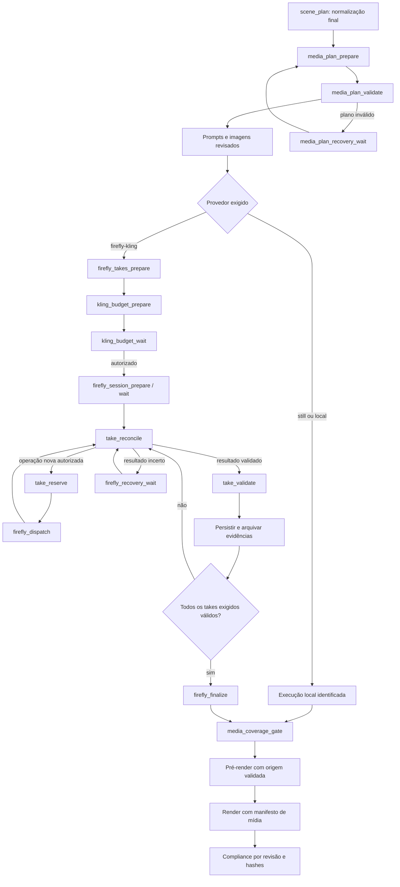

# Firefly P0 — plano de correção dos grafos

Data: 2026-09-05. Estado: proposta técnica; nenhuma geração externa ou alteração de implementação executada nesta análise.

## 1. Resultado exigido

Quando o perfil escolhido exige Firefly, o grafo precisa selecionar cenas com movimento motivado, planejar takes, obter autorização limitada, executar ou reaproveitar takes com origem comprovada e demonstrar seu uso no vídeo final. Zero takes não pode satisfazer esse perfil. Um arquivo local com zoompan não pode satisfazer um requisito Firefly.

Não existe garantia de disponibilidade permanente do Adobe, do modelo, da autenticação ou do navegador. A garantia implementável é: falhas conhecidas interrompem o fluxo com evidência e retomada definida, sem sucesso falso e sem reenvio automático de uma operação paga cujo resultado é incerto. Idempotência completa no provedor depende das capacidades reais do adaptador externo; checkpoint sozinho não oferece exatamente uma cobrança.

## 2. Evidências verificadas no workspace

Runtime instalado: `@langchain/langgraph` 1.4.14 e Remotion 4.0.513. A implementação deve usar as APIs dessa instalação e verificar compatibilidade antes de incorporar exemplos da documentação mais recente.

| Evidência | Consequência | Local |
|---|---|---|
| EP003 tem 58 beats, 10.800 frames, todos `generated_image_35mm` | Mudar somente o modo não cria takes | `runs/HSL_EPISODE_003/scene-plan.json` |
| Storyboard de cooling atribui modo de imagem aos beats | Ausência de decisão explícita de mídia | `hsl/editorial/topicStoryboards.ts`, função `getAiCoolingBeatData` |
| Arestas condicionais escolhem caminho legado por `mediaMode` | Provedores reais são desviados | `graph/production/graph.ts` |
| `fireflyGuide` filtra beats e prompts; aceita nenhuma geração requerida | Zero takes e todos os takes reaproveitados recebem tratamento semelhante | `graph/production/nodes/firefly_real.ts` |
| `routeTakes` usa `every()` sem validar cardinalidade | Array vazio segue para finalização | Mesmo arquivo |
| `joinVideos` apenas conta resultados e encerra estágio | Zero vídeos pode concluir estágio | `graph/production/nodes/join_videos.ts` |
| Reutilização considera arquivo/codec/dimensões/duração | Arquivo antigo ou de outro provedor pode passar | `reusable`, em `firefly_real.ts` |
| Recibo de despacho já existe e não há retry genérico no nó pago | Preservar e fortalecer essas proteções existentes | `graph/production/lib/firefly/process.ts`, `graph.ts` |
| Hash do guia inclui nome do arquivo de imagem, sem hash de seus bytes | Substituir imagem no mesmo caminho não muda essa identidade | `stageGuide`, em `process.ts` |
| Auto-cura chama `HslFireflyVideoEngine`, cujo processamento é zoompan | Validação pode tentar repor Firefly com movimento local | `hsl/core/hslValidationGatekeeper.ts`, `hslFireflyVideoEngine.ts` |
| `recursionLimit: 128`; ciclo dispatch → intake → archive por take | Na mesma invocação, 43 takes já exigem 129 passos só nesse ciclo | `graph/production/runner.ts`, `graph.ts` |
| Rewind infere predecessor por posição em `NODE_ORDER` e limpa decisões | Não representa com segurança todas as dependências e autorizações do DAG | `rewind`, em `runner.ts` |
| Compliance reaproveita relatório aprovado por episodeId | Aprovação antiga pode sobreviver a mudança de mídia | `graph/production/nodes/compliance.ts` |
| Seletores de arquivo não incluem explicitamente recibos de autorização/despacho | Evidência precisa entrar no contrato de retenção | `graph/production/storage/selectors.ts` |

Os riscos de limite de passos, identidade do cache e recuperação local são inferências diretas dessas condições; não são alegações de que novas cobranças duplicadas ocorreram no EP003.

## 3. Arquitetura proposta

Manter `StateGraph` e o checkpointer SQLite existentes. Acrescentar nós com responsabilidade única; não substituir o fluxo por um supervisor LLM livre para decidir sobre cobrança ou sucesso.

Diagrama resume o ramo de vídeo; demais nós de áudio, armazenamento e gates permanecem conectados. Perfil híbrido pode possuir imagens, movimento local e Firefly na mesma execução; a barreira final confere a união exata dos resultados exigidos. A ordem efetiva de sessão/orçamento deve permitir preflight sem gasto, mantendo despacho condicionado à autorização.

## 4. Contrato de mídia e papel dos agentes

Introduzir `mediaPolicy` explícita no CLI/Matrix, separada de `mediaMode`. Perfis propostos: `stills`, `local-motion`, `firefly-hybrid`. O último exige cobertura Firefly positiva; o perfil local nunca anuncia Firefly. Conflito entre perfil Firefly e modo legado deve falhar antes do despacho. Uma variável de ambiente ausente não pode mudar o perfil.

Acrescentar `mediaPlan` versionado ao estado, com schema validado em runtime e arquivo persistido. Para cada beat:

- `beatId`, identidade editorial de origem e revisão do plano;
- `provider: none | local-ffmpeg | firefly-kling`;
- `motionIntent: none | camera | physical`, justificativa editorial e objetivo observável;
- frames de exibição, política de encaixe e dependências;
- motivo de exclusão de Firefly quando aplicável;
- hashes e versões dos contratos que determinam a mídia.

`visualMode` continua como projeção para compatibilidade com Remotion, derivada de `mediaPlan`; não haverá duas fontes independentes de escolha do provedor. O tipo final de render precisa representar também vídeo local sem chamá-lo de Firefly. Tipos, renderizador, validadores e leitores de plano devem ser atualizados juntos.

**Agente de direção:** propõe movimento correlacionado ao conteúdo, em saída estruturada. **Revisor editorial:** avalia pertinência, continuidade e distorção visual. **Validador determinístico:** verifica IDs, provedores permitidos, cobertura, duração, cardinalidade, dependências e consistência. A revisão editorial pode ter no máximo duas tentativas antes de recuperação; não pode autorizar gasto, inventar resultado nem promover execução a COMPLETED.

Para o storyboard cooling, adicionar metadados explícitos de elegibilidade: travellings de corredores/CDUs, circulação visível em manifold transparente, vapor de torres e operações mecânicas observáveis são candidatos. Diagramas, mapas, fórmulas e layouts cuja precisão precisa ser preservada têm preferência local. A seleção final ocorre **depois** da normalização de duração, porque ela descarta beats e renumera IDs. Preservar `sourceBeatId` para linhagem.

Exigir política de cobertura definida por perfil, incluindo quantidade mínima de cenas/frames e distribuição editorial quando requerida. O piso técnico é não vazio; ele sozinho não garante qualidade. Não escolher arbitrariamente uma cena apenas para ultrapassar o piso. Ausência de candidatos válidos produz `MEDIA_PLAN_REQUIRED_PROVIDER_EMPTY`, com reparo editorial; não `skipped`.

Para EP003, o dry-run futuro deverá imprimir a lista concreta de cenas, razões, frames Firefly, takes totais e novas gerações. Não há ainda uma contagem corrigida aprovada: os 58 beats atuais são imagens. Não inventar um orçamento antes de resolver o plano.

## 5. Planejamento de takes e autorização

Separar o atual `fireflyGuide` em preparação pura/persistida de takes, cálculo de orçamento e espera de decisão. Validar igualdade de conjuntos: beats Firefly exigidos = beats com prompts válidos = beats cobertos pelo plano de takes. Falta, duplicação ou ID estranho deve falhar com os IDs afetados.

Calcular takes a partir de cobertura temporal explícita. O adaptador atual pede 5 segundos; sua regra `splitOver=5.5` aceita um take de 5s para uma cena maior. Para eliminar déficit oculto, adotar como padrão cobertura integral sem extensão implícita: `ceil(framesDoBeat / (5 * fpsDoProjeto))`, com corte do excedente no final. Exemplo: 5,43s requer dois takes nesse padrão; 8,37s requer dois. Política opcional de retime/hold só pode existir se declarada, limitada, validada e registrada antes da autorização. Nunca repetir vídeo silenciosamente para preencher duração.

O FPS do arquivo do provedor pode diferir dos 30 FPS da timeline: validar perfil efetivamente contratado, normalizar na composição de cena e conferir frames finais, sem exigir um FPS que o adaptador não fornece. Testar a duração medida real, não apenas a duração solicitada.

Identidades distintas:

- `planHash`: decisões de mídia e timeline, independente do estado transitório de downloads;
- `recipeHash`: prompt de vídeo, perfil/modelo, parâmetros, imagem revisada e dependências;
- `operationId`: identidade estável da tentativa autorizada, preservada em resume;
- `inputFrameHash` e `outputHash`: bytes concretos usados/produzidos.

Takes de continuação são autorizados por sua receita e vínculo com o predecessor; o hash do frame extraído é desconhecido antes da geração anterior. Registrar esse hash quando a dependência estiver validada, verificando que deriva do predecessor autorizado. Alterar um predecessor invalida descendentes e os resultados derivados; não reutilizar vídeo por caminho.

Orçamento considera a partição dos takes em reutilizáveis verificados, pendentes sem despacho e operações em reconciliação. Apenas pendentes seguros entram em novas reservas. Resultado incerto continua ocupando sua reserva até reconciliação; não o contar automaticamente como geração nova nem como crédito devolvido.

Recibo `kling-authorization` deve persistir run/revisão, `planHash`, escopo das receitas, limite de novas operações, origem da autorização, instante e decisão. `maxGenerations=0` continua exigindo autorização quando houver geração nova. Zero novas gerações é válido se há takes exigidos e **todos** são reaproveitáveis com proveniência válida.

CLI direto e Matrix devem consumir o mesmo serviço de autorização. A flag de ambiente `HSL_ALLOW_PAID_FIREFLY_DISPATCH` pode continuar como habilitação operacional, mas não substitui o recibo nem o limite. Uma autorização válida deve sobreviver ao fechamento do terminal; não depender apenas de uma variável no subprocesso do Matrix. Invalidar autorização por alteração de escopo e expor exatamente a diferença a autorizar.

## 6. Despacho durável, concorrência e retomada

Preservar o recibo atômico já existente em `process.ts` e a ausência de retry genérico em `firefly_dispatch`. Evoluir para ledger durável de autorização, reserva e operação, com transação/índice único por `operationId`. JSON pode ser o espelho auditável; um store SQLite dedicado evita depender das estruturas internas do saver.

Estados sugeridos: `planned → reserved → submitted → downloaded → validated`, além de `reused`, `uncertain`, `rejected`, `cancelled`. A transição para reservado ocorre antes do efeito externo e é recuperável independentemente do retorno do nó. Registrar ID do job externo e evidências disponíveis quando o adaptador os expuser. Não inventar identificador remoto.

O checkpointer persiste fronteiras entre passos; variáveis locais modificadas antes de um crash/interrupt não são recibo de cobrança. Separar o nó com efeito externo do nó que chama `interrupt`. Na retomada, `take_reconcile` examina o ledger, os recibos externos e o arquivo antes de decidir o próximo passo. Se o externo concluiu antes da morte do processo, somente ingerir e validar. Se houve possível envio sem evidência conclusiva, manter `uncertain`; não reenviar automaticamente.

Reutilização exige arquivo decodificável, receita compatível, hash dos inputs, provedor/modelo identificados, recibo verificável e validação do output. Recibo de processo concluído não equivale a vídeo aprovado. Diferenciar conclusão de transporte e aprovação de mídia.

Manter concorrência paga 1 por perfil Chrome nesta correção. A reserva e a posse do perfil precisam ser exclusivas também entre CLI, supervisor e workers; o lock do CLI isolado não protege todos os entrypoints. Em perda de posse/lease, o novo worker reconcilia antes de qualquer envio. Um processo externo vivo deve ser considerado na recuperação após crash do pai. A auditoria também deve conferir retries dentro do agente Python, não apenas os do LangGraph.

No estado do grafo, manter snapshots por chave estável de operação e revisão, com merge idempotente/revisão monotônica; anexar eventos ao histórico separadamente. Reexecutar um update não pode duplicar contagem nem sobrescrever sucesso por um snapshot antigo. Não introduzir fan-out pago enquanto estado e posse do perfil não suportarem isso.

## 7. Validação que impede falso sucesso

`media_coverage_gate` deve verificar o conjunto exato de vídeos exigidos, provedor, cadeia de recibos, hashes, QA e duração de cada cena. Também deve distinguir `NOT_REQUIRED`, `REUSED_VERIFIED`, `GENERATED_VERIFIED` e `BLOCKED` na telemetria.

No intake: validar decodificação, dimensões, aspect ratio, codec e duração do perfil; analisar frames amostrados e movimento, continuidade com a imagem aprovada e correlação com o episódio. Hash diferente entre primeiro e último frame não prova movimento útil: compressão pode mudar pixels. Métricas temporais e revisão visual têm limitações; resultados inconclusivos precisam ficar explícitos. QA reprovado não autoriza automaticamente outra geração.

No gatekeeper: para mídia Firefly, recuperação só pode reencontrar/baixar/validar operação existente ou retornar ao fluxo autorizado para uma nova tentativa. Proibir `HslFireflyVideoEngine`/zoompan como auto-cura desse provedor. Renomear o motor legado para movimento local, com wrapper de compatibilidade durante migração se necessário.

No render: produzir manifesto dos assets efetivamente resolvidos, vinculando scene/beat → output hash → provider → intervalo de frames. Conferir que os vídeos Firefly aprovados são os utilizados. Plano e take presentes no disco, mas nunca usados no vídeo, não satisfazem o requisito.

No cache: identidade de props, chunks, master, gatekeeper e compliance deve incluir hashes de mídia e versão de política. A verificação de duração já corrigida não detecta imagem substituída por vídeo com a mesma duração. Uma mudança de mídia invalida somente os derivados afetados, inclusive um master antigo de 360s.

`join_videos`, gatekeeper e `finalize` devem impedir COMPLETED com requisito não atendido, mesmo se um relatório antigo disser PASS. Acrescentar regras de compliance: provedor exigido, cobertura, proveniência, autorização, uso no render e duração. Arquivar planos e recibos como evidência persistente; colocá-los fora de prune de intermediários. Mover/complementar o arquivamento após `firefly_finalize` para incluir o vídeo composto, além dos takes.

## 8. Escalabilidade do grafo e migração

Não simplesmente aumentar `recursionLimit` para um número enorme. Calcular limite finito a partir de beats/takes/chunks e tentativas permitidas, cobrindo os passos do restante da produção. Na primeira entrada, usar limite conservador derivado das restrições do plano; no resume, usar trabalho pendente e transições previstas. Testar a semântica da versão instalada. Loops editoriais e de sessão precisam ter terminação explícita por espera, progresso ou falha, nunca espera ativa ilimitada.

Uma divisão futura em subgrafos melhora isolamento, mas não elimina por si só consumo de supersteps ou duplicação de efeitos. Nesta correção, preservar a topologia pública quando viável e colocar recuperação em nós explícitos.

Acrescentar campos de schema com defaults/compatibilidade. Não mudar simplesmente `STATE_VERSION` e perder acesso a threads `@v2`. Inspecionar checkpoints pendentes; manter nós antigos como adaptadores enquanto existirem threads referenciando esses nomes. Threads em etapa posterior ao novo planejamento precisam de migração explícita, pois inserir nó não o executa retroativamente.

Substituir rewind por posição linear por mapa de dependências e pontos de retomada suportados. `--from firefly_dispatch` não pode contornar plano/autorização. Rewind invalida derivados, mas não apaga ledger financeiro ou recibos válidos. Mudança de plano cria nova revisão vinculada à anterior, com reavaliação de escopo.

EP003 está concluído no estado antigo: `resume` simples não reexecuta planejamento. Criar revisão de correção com linhagem, preservar áudio/imagens aprovados somente se compatíveis, executar planejamento de mídia, autorizar o orçamento resultante e renderizar novamente após cobertura validada. O master anterior permanece identificado como anterior.

## 9. Sequência de implementação e aceite

| Ordem | Entrega concreta | Principais arquivos | Aceite |
|---|---|---|---|
| 1 | Contrato de perfil/provedor e bloqueios de falso sucesso | `state.ts`, `cli.ts`, console, `join_videos.ts`, `finalize.ts`, gatekeeper | Firefly exigido com zero takes ou vídeo local não chega a COMPLETED |
| 2 | Planejamento editorial após normalização e schema validado | `topicStoryboards.ts`, `scene_plan.ts`, novos `media_plan`/schemas | Dry-run cooling 6min produz lista motivada e não vazia mantendo 10.800 frames |
| 3 | Preparação de takes, cobertura e orçamento separado | `firefly_real.ts`, `lib/firefly/guide.ts`, nós de orçamento | Conjuntos iguais; contagem exata; limites de 5s testados; sem gasto em planejamento |
| 4 | Ledger, proveniência, reserva, reconciliação e CLI unificado | `lib/firefly/process.ts`, `state.ts`, runner, supervisor | Morte de processo não duplica envio; ambiguidade suspende; limites sobrevivem a restart |
| 5 | Coverage gate, render/QA e invalidação de caches | `firefly_finalize`, gatekeeper, Remotion, compliance, storage | Arquivo esperado é o utilizado; mudança de mídia invalida master de mesma duração |
| 6 | Migração/rewind, limite de passos e progresso | `graph.ts`, `runner.ts`, checkpointer, console | Threads antigas recuperáveis; execução longa termina; estados não confundem ausência com reuso |
| 7 | Validação real e recuperação do EP003 | Plano de canário e nova revisão do episódio | Evidências externas + QA + orçamento real respeitado; master final de 360s |

Não liberar parcialmente a cadeia de geração paga antes de a autorização e a reconciliação estarem integradas.

## 10. Testes de regressão obrigatórios

1. Cooling original: 58 imagens + perfil Firefly → planejamento válido não vazio ou bloqueio explícito; nunca sucesso vazio.
2. Perfis local/stills → zero chamada externa, provedor/status corretos. Perfil Firefly + legado → configuração rejeitada.
3. Prompts ausentes, duplicados ou estranhos → falha antes de despacho com IDs afetados.
4. Durações nas fronteiras de 5s/5,5s e beats longos → cobertura integral, dependências acíclicas e encaixe exato na timeline.
5. `maxGenerations=0` → interrupt; limite insuficiente → nenhum envio adicional; abort → zero envio.
6. Reuso total com proveniência válida → zero novas cobranças e Firefly satisfeito por reuso comprovado.
7. MP4 local, hash de imagem alterado no mesmo caminho, modelo/prompt diferente, arquivo corrompido → cache rejeitado.
8. Matar subprocesso antes/depois de reserva, após possível envio, após download e antes do checkpoint → reconciliar sem duplicação; usar falhas reais de processo além de mocks.
9. Mudança do plano após autorização → bloquear escopo divergente. Regeneração de QA necessita saldo/escopo explicitamente autorizado.
10. Dois processos disputando mesma operação/perfil → no máximo um dono autorizado; operação incerta não é reenviada pelo segundo.
11. Sessão expirada ou perfil ocupado → espera recuperável, sem downgrade de provedor.
12. Auto-cura não produz zoompan para cumprir Firefly; ausência de evidência bloqueia render.
13. Manifesto de render aponta mídia incorreta ou master antigo de mesma duração → invalidar; relatório antigo PASS não prevalece.
14. Thread antiga interrompida em orçamento/despacho e `--from` → migração correta e ledger preservado.
15. Run simulada com 100+ takes e restart → termina dentro do limite calculado, mantendo total autorizado e contadores únicos.
16. Variações aleatórias de durações, sequências de eventos e resumes → invariantes de cobertura, cardinalidade, monotonicidade e limite de reservas permanecem válidos.
17. Suites existentes de produção, fase2, supervisor e TypeScript continuam aprovadas; atualizar fixtures sem esconder condições vazias/inconsistentes.

Validação externa final: canário aprovado de escopo mínimo, seguido de canário de continuação para extração do último frame e dependência. Dry-run deve informar exatamente o gasto pretendido antes de executar. Registrar operação, provedor/modelo observado, inputs, output, QA e uso em um render de teste. Testes com mocks não demonstram que o Adobe executou uma geração real.

## Estado da implementação

Implementação do grafo e regressões offline: [relatório e evidências](EP003-AUDIT-2026-09-05/FIREFLY-P0-IMPLEMENTACAO.md). A homologação no Adobe e a revisão final do EP003 continuam pendentes. O agente Python encontrado localmente é incompatível com os comandos de sessão/reconciliação exigidos e contém retries internos que precisam ser corrigidos antes do despacho real. Nenhuma geração paga foi executada.

## 11. Referências oficiais utilizadas

- [LangGraph JS — Interrupts](https://docs.langchain.com/oss/javascript/langgraph/interrupts): retomada reexecuta o nó; separar efeitos externos de espera e manter operações idempotentes.
- [LangGraph JS — Persistence](https://docs.langchain.com/oss/javascript/langgraph/persistence): persistência por checkpoint e thread; não é transação com o provedor externo.
- [LangGraph JS — Graph API](https://docs.langchain.com/oss/javascript/langgraph/graph-api): reducers, arestas condicionais, supersteps e limite de recursão.
- [LangGraph JS — Backward compatibility](https://docs.langchain.com/oss/javascript/langgraph/backward-compatibility): evolução compatível de schema/nós para threads existentes.

Conclusão de aceite: implementação só estará validada para produção depois das regressões e do canário externo. O critério permanente é que indisponibilidade ou inconsistência fique bloqueada e auditável, nunca apresentada como Firefly executado com sucesso.
